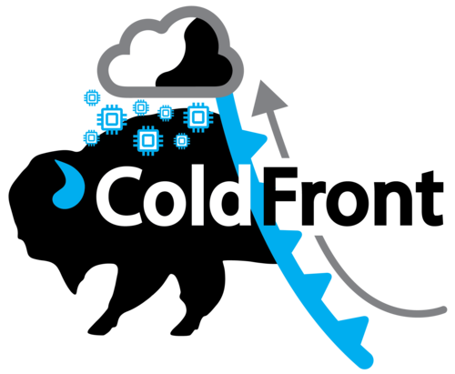

# ColdFront - Resource Allocation System

ColdFront is an open source resource and allocation management system designed to provide a
central portal for administration, reporting, and measuring scientific impact
of cyberinfrastructure resources. ColdFront was created to help high performance computing (HPC) centers manage access to a diverse set of resources across large groups of users and provide a rich set of
extensible meta data for comprehensive reporting. The flexiblity of ColdFront allows centers to manage and automate their policies and procedures within the framework provided or extend the functionality with [plugins](docs/pages/index.md#extensibility).  ColdFront is written in Python and released under the GPLv3 license.

## Features

- Allocation based system for managing access to resources
- Self-service portal for users to request access to resources for their research group
- Collection of Project, Grant, and Publication data from users
- Center director approval system and annual project review process
- Email notifications for expiring/renewing access to resources
- Ability to define custom attributes on resources and allocations 
- Integration with 3rd party systems for automation, access control, and other system provisioning tasks

[Read more](docs/pages/index.md)  

## Community Supported Plugins

- [OpenStack Plugin](https://github.com/nerc-project/coldfront-plugin-openstack)
- [Keycloak User Search](https://github.com/nerc-project/coldfront-plugin-keycloak)
- [Starfish Plugin](https://github.com/fasrc/sftocf)

_Submit a PR to add your plugin to the list above._

## Documentation

For more information on installing and using ColdFront see our [documentation here](https://coldfront.readthedocs.io)

## Contact Information
If you would like a live demo followed by QA, please contact us at
ccr-coldfront-admin-list@listserv.buffalo.edu. You can also contact us for
general inquiries and installation troubleshooting.

If you would like to join our mailing list to receive news and updates, please
send an email to listserv@listserv.buffalo.edu with no subject, and the
following command in the body of the message:

subscribe ccr-open-coldfront-list@listserv.buffalo.edu first_name last_name

## License

ColdFront is released under the AGPLv3 license. See REUSE.toml.
