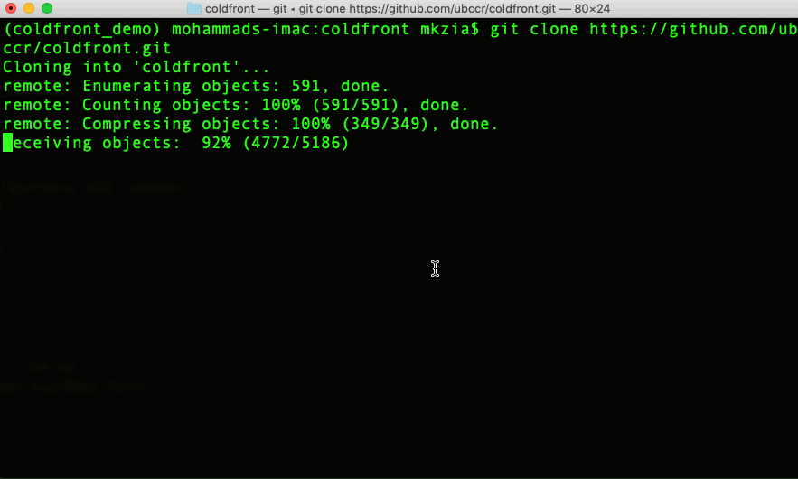
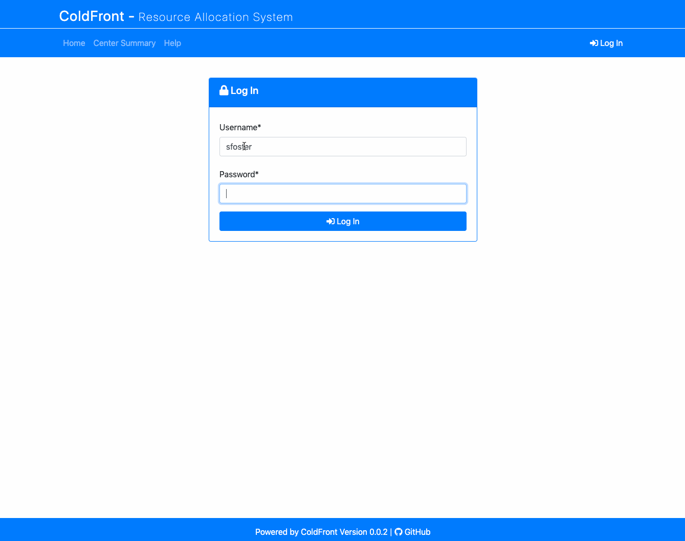
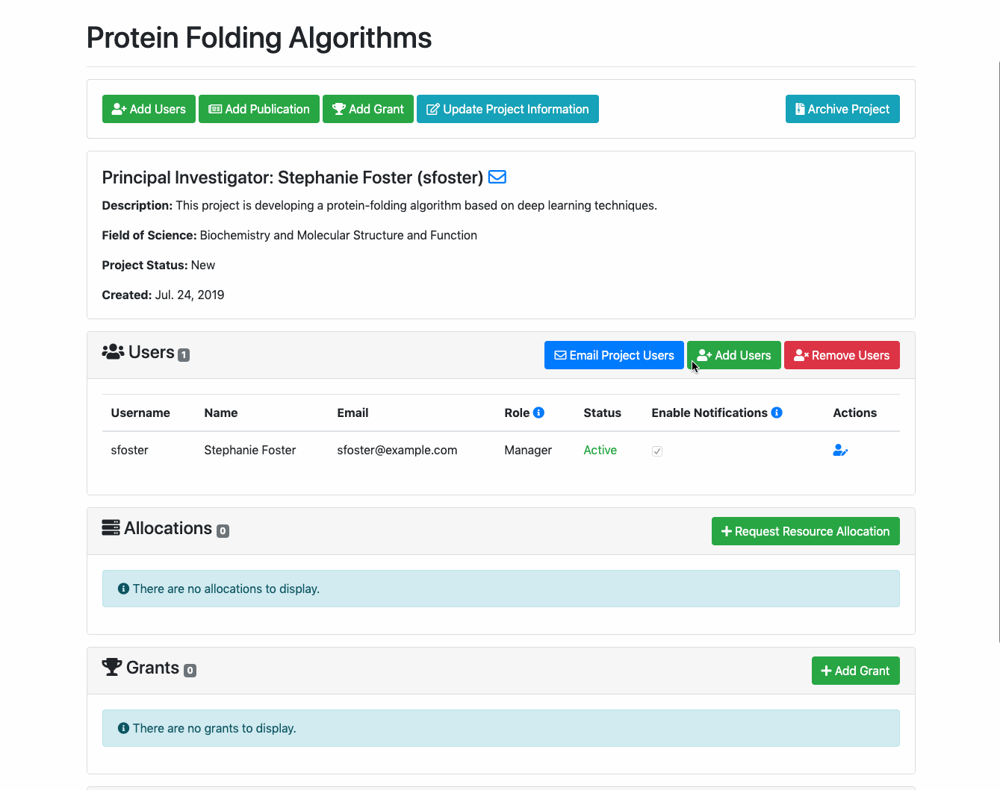
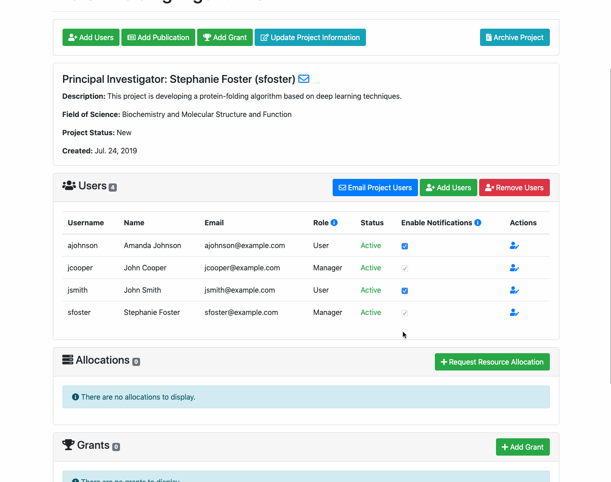
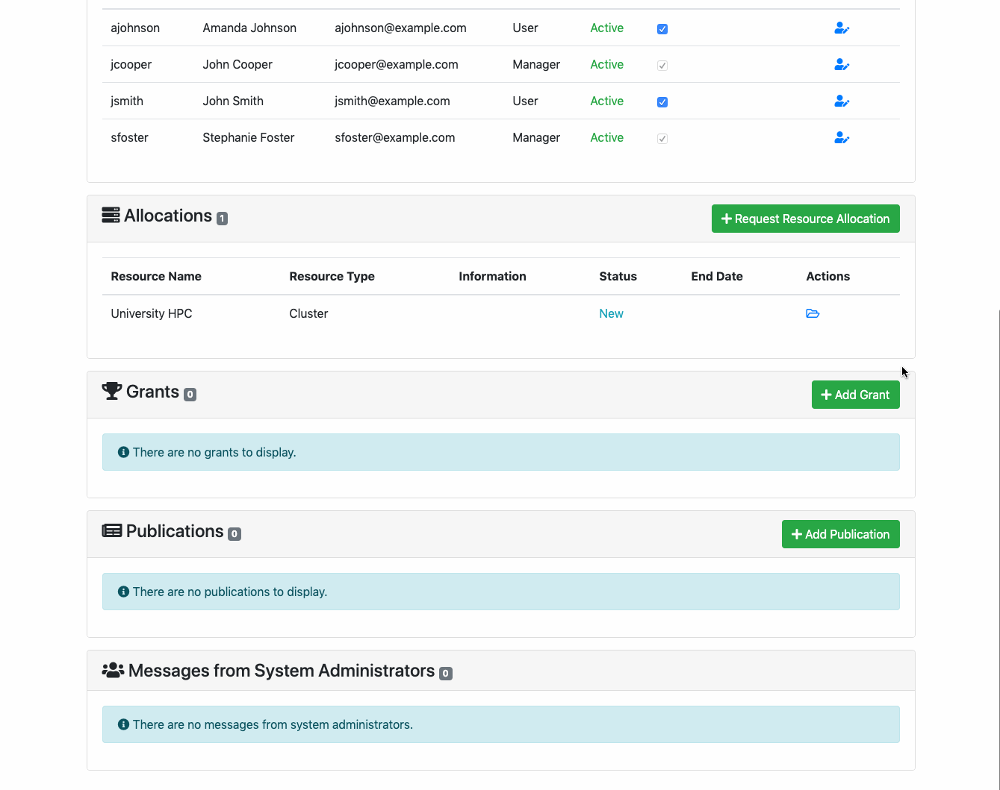
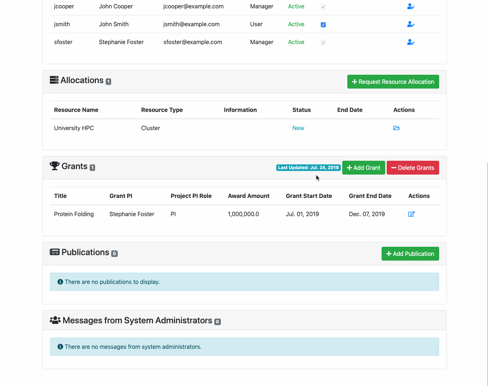
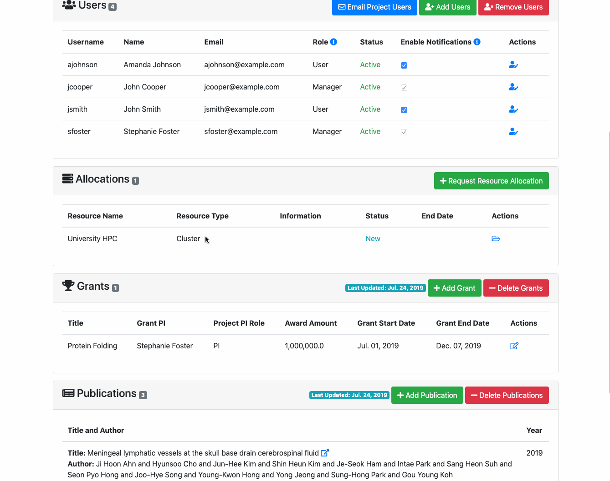
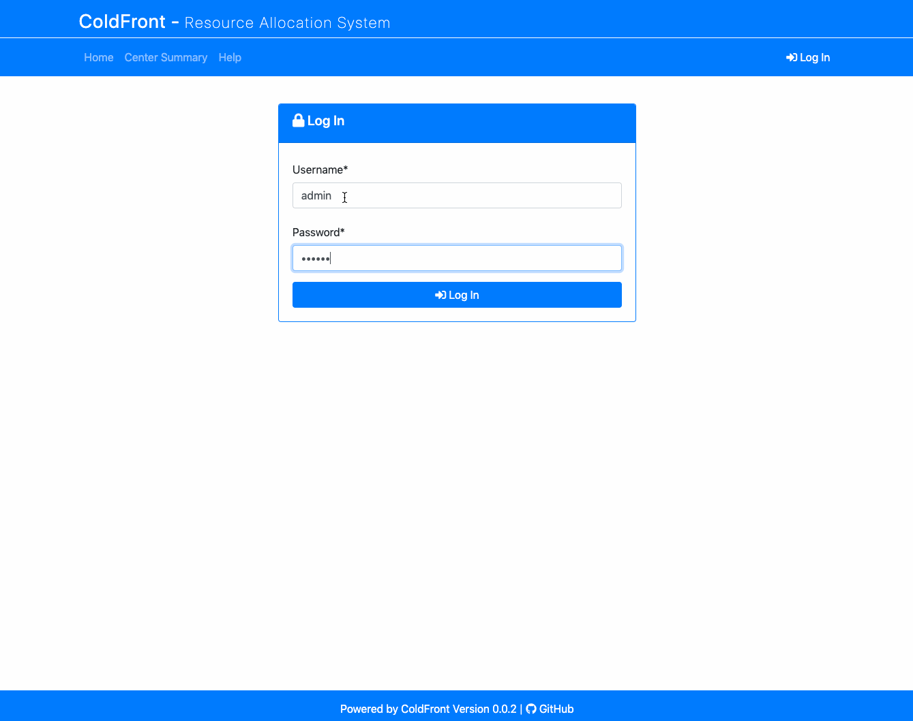
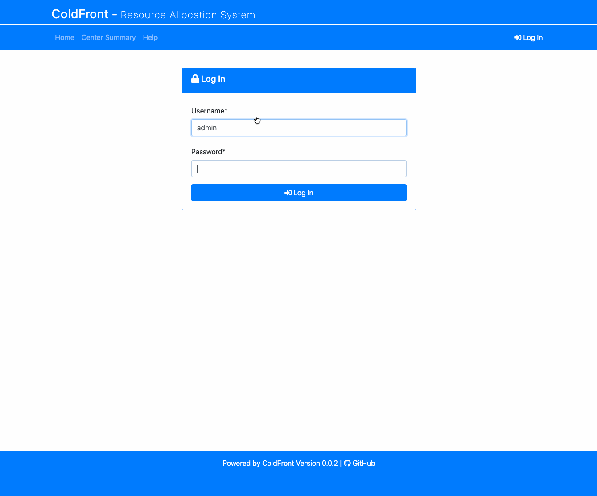
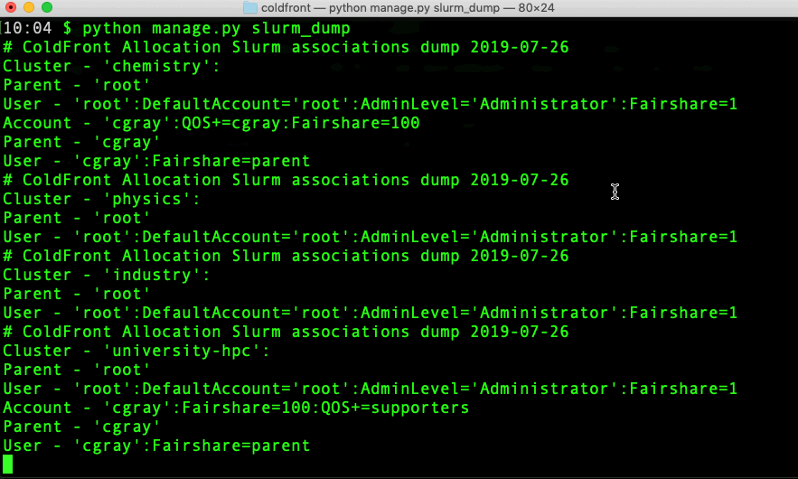

# ColdFront - Resource Allocation System

ColdFront is an open source resource allocation system designed to provide a
central portal for administration, reporting, and measuring scientific impact
of HPC resources. ColdFront was created to help HPC centers manage access to a
diverse set of resources across large groups of users and provide a rich set of
extensible meta data for comprehensive reporting. ColdFront is written in
Python and released under the GPLv3 license.

## Features

- Allocation based system for managing access to resources
- Collect Project, Grant, and Publication data from users
- Define custom attributes on resources and allocations
- Email notifications for expiring/renewing access to resources
- Integration with 3rd party systems for automation and access control
- Center director approval system and annual project reviews

## Plug-in Documentation
 - [Slurm](coldfront/plugins/slurm)
 - [FreeIPA](coldfront/plugins/freeipa)
 - [LDAP](coldfront/plugins/ldap_user_search)
 - [Mokey/Hydra OpenID Connect](coldfront/plugins/mokey_oidc)
 - [iQuota (Isilon)](coldfront/plugins/iquota)
 - [XDMoD](coldfront/plugins/xdmod)
 - [System Monitor](coldfront/plugins/system_monitor) (example of ways to integrate your own plug-ins)

## Contact Information
If you would like a live demo followed by QA, please contact us at ccr-coldfront-admin-list@listserv.buffalo.edu. You can also contact us for general inquiries and installation troubleshooting. 

If you would like to join our mailing list to receive news and updates, please send an email to listserv@listserv.buffalo.edu with no subject, and the following command in the body of the message:

subscribe ccr-open-coldfront-list@listserv.buffalo.edu first_name last_name


## Installation Demo


[Click here for more demos](#demos)

## Quick Install

1. ColdFront requires Python 3.6, memcached, and redis. 

### CentOS (7.5)

Install EPEL then install required packages:

```
sudo yum install epel-release
sudo yum install python36 python36-devel memcached redis
``` 

### Ubuntu (16.04)
```
sudo add-apt-repository ppa:jonathonf/python-3.6
sudo apt-get update
sudo apt-get install python3.6 python3.6-venv memcached redis-server
``` 

2. Clone ColdFront in a new directory and create a Python virtual environment for ColdFront
```
mkdir coldfront_app
cd coldfront_app
git clone https://github.com/ubccr/coldfront.git
python3.6 -mvenv venv
```

3. Activate the virtual environment and install the required Python packages
```
source venv/bin/activate
cd coldfront
pip install wheel
pip install -r requirements.txt

```

4. Copy coldfront/config/local_settings.py.sample to coldfront/config/local_settings.py. 
```
cp coldfront/config/local_settings.py.sample coldfront/config/local_settings.py
```

5. Copy config/local_strings.py.sample to config/local_strings.py and update if desired. 
```
cp coldfront/config/local_strings.py.sample coldfront/config/local_strings.py
```

6. Run initial setup
```
python manage.py initial_setup
```

7. OPTIONAL: Add some test data
```
python manage.py load_test_data
```

8. Start development server
```
python manage.py runserver 0.0.0.0:8000
```

9. Point your browser to http://localhost:8000

You can log in as `admin` with password `test1234`. 
You can log in as a PI using username `cgray` with password `test1234`.
You can log in as another PI using username `sfoster` with password `test1234`.

Password for all users is also `teset1234`. 


## Directory structure

- coldfront
    - core - The core ColdFront application
        - field_of_science
        - grant
        - portal
        - project
        - publication
        - resource
        - allocation
        - user
        - utils
    - libs - Helper libraries
    - plugins - Plugins that can be configured in ColdFront
        - freeipa
        - iquota
        - ldap_user_search
        - mokey_oidc
        - slurm
        - system_monitor


## <a name="demos"></a>ColdFront Demonstration

### Adding a Project


### Adding Users


### Requesting an Allocation


### Adding a Grant


### Adding Publications


### Adding a User to an Allocation


### Managing an Allocation as an Admin


### Adding a Resource


### Generate Slurm Association Data 


## License

ColdFront is released under the GPLv3 license. See the LICENSE file.
