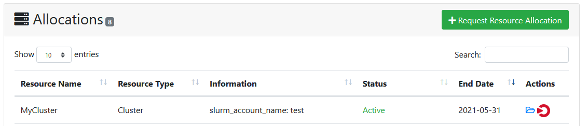

# Open OnDemand integration for ColdFront

ColdFront django plugin providing Open OnDemand integration for ColdFront.  [Open
OnDemand](https://openondemand.org/) is an open source portal that facilitates easy
access to high performance computing resources directly through a web browser.

## Design

This plugin allows for resources in ColdFront to be "OnDemand enabled" so users can click directly to your Center's OnDemand dashboard right from ColdFront.

## Usage

To enable this plugin set the following environment variable:

```
ONDEMAND_URL="https://ondemand.example.com"
```
To configure a resource as "OnDemand enabled" add the OnDemand attribute to the resource in the ColdFront admin interface as shown here using the sample data:  
Resource=cluster  
Add Attribute - select OnDemand from the drop-down menu and enter 'Yes' in the text box.  
Make sure to Save the changes.  


In the ColdFront portal, look at allocations for the resource you've set to be "OnDemand enabled"  These will now display the OnDemand logo and, when clicked, will open the OnDemand URL set in local_settings.py.  This will show up on the main home page under the Allocations column and also on the Project Detail page next to any "OnDemand enabled" allocations.    

