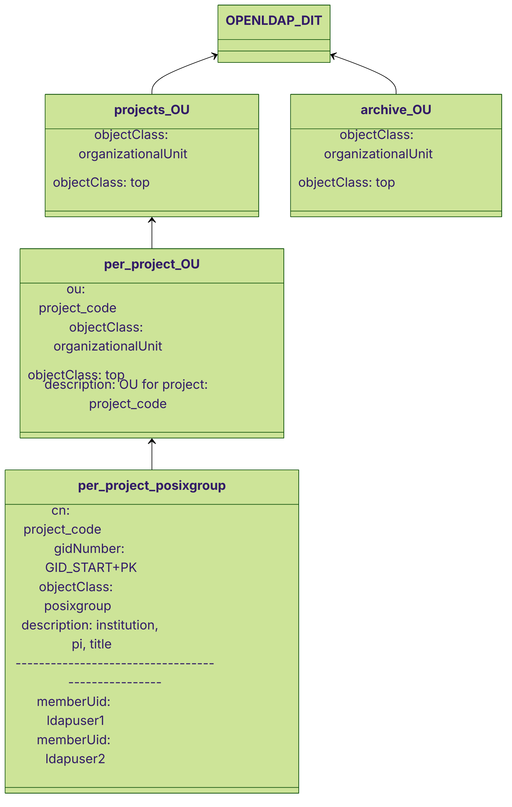

# project_openldap - A plugin to push project information to an OpenLDAP instance

Coldfront django plugin providing capability to push project information to OpenLDAP. 

OpenLDAP is a commonly deployed Identity Provider (IdP) - see https://www.openldap.org/

This plugin makes use of django signals within Coldfront to push project information to OpenLDAP. The main motivation for this is so projects and their members can be represented inside a _PosixGroup_, with usage of _memberUid_ (for members). Having this information in OpenLDAP facilitates the usage of filesystem quotas and other activities on a project basis.

**The motivation for using this plugin, is that you want Coldfront and it's WebUI to be the source of truth**. This might be in contrast to another operating modality where information is [generally] imported from another system or IdP into Coldfront.
- You will still need some means of creating/registering users in your OpenLDAP, e.g. a user registration portal - that is not covered/provided here. If you are just testing, you might add these to the DIT with ldifs.

- **NOTE: The plugin doesn't write a Coldfront project's allocation(s) into OpenLDAP. It is expected a separate plugin will do this.**


## Design

The plugin results in each Coldfront project being created in OpenLDAP with an associated OU and a posixgroup with synchronized membership. 

- **NOTE:** Each project gets a **<ins>per project group _OU_</ins>** AND **<ins>a per project group _posixgroup_</ins>** written.

To do this django signals are used, which fire upon actions in the Coldfront WebUI. E.g. project creation.

The plugin uses a bind user (which the site has to setup with appropriate write access) and _python ldap3_ to write changes to OpenLDAP.

The **bind user** will **write to a project project OU** and **potentially an archive OU** (if defined by the site admin).

The OpenLDAP server (slapd) must be operational and ready to accept changes via the configured bind user.

Variables to use to configure the plugin are detailed further down in this ``README.md``

### Design - signals and actions

#### signals

The following five Coldfront django signals are used by this plugin, upon Coldfront WebUI actions:

- project new
- project archive
- project update (e.g. update title)
- add project member(s)
- remove project member(s)

To see the exact receiver definitions look at the ``signals.py`` within the plugin directory.

#### actions

The aforementioned signals trigger functions in tasks.py, these in turn use functions in ``utils.py`` to accomplish the action required. Examples are:

- create a per project OU and per project posixgroup within a Projects OU - **new project**
- move a per project OU (and per project posixgroup) to an Archive OU or simply delete it - **archive project** - which action depends on environment variable setup
- add members to the per project posixgroup - **project add members**
- remove members from the per project posixgroup - **project remove members**
- update title - **project update**

The next section shows the representation in OpenLDAP.

### DIT Diagram

DIT Mermaid diagram. 

- Projects get created in the Projects OU. A per project OU and a per project posixgroup is created.
- Per project OU's get moved to Archive OU or deleted on Coldfront WebUI archive action.
- **If no Archive OU** is setup by the site administrator, then **projects** (per project OUs) are **deleted on archival**.





### Syncronization and management command usage

Should Coldfront continue creating or modifying projects whilst the OpenLDAP server is unavailable, corrective action will likely be needed. A management command is provided to perform checks and synchronize changes required. This should only be used when Coldfront and OpenLDAP are (or are suspected) to be out of sync.

From within the Coldfront user's venv environment, the management command help can be seen:

``coldfront project_openldap_sync --help``

Further detail on the management command can be seen in the directory ``README.md``

Also included within that directory is a Mermaid diagram (``Mermaid.md``) of the main function of the sync management command.

### Optional setup checker

Another management command is present to aid setup checks for this plugin, before entering production. See command's help and/or ``README.md`` in management command directory.

``coldfront project_openldap_check_setup --help``


## Requirements - general

The plugin makes extensive use of the _python ldap3_ library - https://ldap3.readthedocs.io/

### Requirements - OpenLDAP

- A working OpenLDAP master instance is required.
- This plugin requires a bind user to make changes. It's recommended that a dedicated bind user is setup for this purpose and this purpose only.
- You will also need to supply an OU to store projects in and optionally an OU to store (move) archived projects to. You should create this in the normal way e.g. ldif.

#### GID:

- **NOTE: A starting GID number to increment posixgroup GIDs is required. Consider this carefully before going into project to avoid clashes or problems.**

#### Security:

- **NOTE: OpenLDAP security and general site security is the responsibility of site administrators.**


## Usage

The plugin requires that various environment variables are defined in the Coldfront django settings - e.g. coldfront.env

Example pre-requisites - we require `project_code` to be enabled, here is an example

**Example Required project_code:**
```
PROJECT_CODE="CDF"
```
Example Optional project_code padding:
```
PROJECT_CODE_PADDING=4
```

### Usage - Example setup

An example setup might look something like this. 
- The institution feature usage is not required or mandated.
- Here we are setup to use the Archive OU and not delete per project OUs upon Coldfront archive action in WebUI

**NOTE:** Security (e.g. SSL + TLS) configuration is the responsibility of the site administrator - these aren't production settings below, only a starting point.

```
PROJECT_CODE="CDF"
PROJECT_CODE_PADDING=4

PLUGIN_PROJECT_OPENLDAP=True
PROJECT_OPENLDAP_GID_START=8000
PROJECT_OPENLDAP_SERVER_URI='ldaps://openldap.coldfront.ac.uk'
PROJECT_OPENLDAP_OU='ou=projects,dc=coldfront,dc=ac,dc=uk'
PROJECT_OPENLDAP_BIND_USER='my_bind_user_dn'
PROJECT_OPENLDAP_BIND_PASSWORD='some_secure_password'
PROJECT_OPENLDAP_CACERT_FILE='/etc/path/to/CAcert'
PROJECT_OPENLDAP_USE_TLS=False

# archive settings
PROJECT_OPENLDAP_REMOVE_PROJECT=True #default is true
PROJECT_OPENLDAP_ARCHIVE_OU='ou=archive_projects,dc=coldfront,dc=ac,dc=uk'

#institution
PROJECT_INSTITUTION_EMAIL_MAP=coldfront.ac.uk=ColdfrontUniversity

```


### Usage - Variable descriptions

**Required Plugin load:**

| Option | Type | Default | Description |
|--- | --- | --- | --- |
| `PLUGIN_PROJECT_OPENLDAP` | Bool | True | Enable the plugin, required to be set as True (bool). |

**Required:**
| Option | Type | Default | Description |
|--- | --- | --- | --- |
| `PROJECT_OPENLDAP_GID_START` | int | N/A | Starting value for project gidNumbers, requires an integer.  |
| `PROJECT_OPENLDAP_SERVER_URI` | str | empty str | The URI of the OpenLDAP instance, requires a string URI.  |
| `PROJECT_OPENLDAP_OU` | str | empty str |The OU where projects will be written, requires a string DN of OU.   |
| `PROJECT_OPENLDAP_BIND_USER` | str | empty str |The bind user, that can write to the `PROJECT_OPENLDAP_OU`, requires a string DN of bind user. |
| `PROJECT_OPENLDAP_BIND_PASSWORD` | str | empty str |The password for the bind user, requires a string. |
| `PROJECT_OPENLDAP_REMOVE_PROJECT` | Bool |True | Required to take action upon archive (action) of a project. Default True (bool). |

**OpenLDAP specific:**
| Option | Type | Default | Description |
|--- | --- | --- | --- |
| `PROJECT_OPENLDAP_CONNECT_TIMEOUT` | int |2.5 | Connection timeout. |
| `PROJECT_OPENLDAP_USE_SSL` | Bool | True | Use SSL. |
| `PROJECT_OPENLDAP_USE_TLS` | Bool | False | Enable Tls. |
| `PROJECT_OPENLDAP_PRIV_KEY_FILE` | str | None | Tls Private key. |
| `PROJECT_OPENLDAP_CERT_FILE` | str | None | Tls Certificate file.  |
| `PROJECT_OPENLDAP_CACERT_FILE` | str | None | Tls CA certificate file. | 

**Optional:**

| Option | Type | Default | Description |
|--- | --- | --- | --- |
| `PROJECT_OPENLDAP_ARCHIVE_OU` | str | empty str | Optional, if this string is defined, then move upon archival action move the project object in OpenLDAP here. Supply a string DN of the desired OU. |
| `PROJECT_OPENLDAP_DESCRIPTION_TITLE_LENGTH` | int | 100 | Optional, this integer will constrain the length of the Coldfront project title, within the OpenLDAP project description field. |


<br>

**Optional, management [sync] command related:**

| Option | Type | Default | Description |
|--- | --- | --- | --- |
| `PROJECT_OPENLDAP_EXCLUDE_USERS` | tuple |  ('coldfront',) | Tuple which by default is a single element tuple that will exclude the "coldfront" username from operations in the Syncer script - e.g. to avoid attempted add to OpenLDAP. |


## Example per project prosixgroup and OU container

An example of a project posixgroup and OU (see further down for OU).

- Using 8000 as the start GID, this is project 11 (pk=11), so 8000+11 is the resultant gidNumber.
- Within the OpenLDAP description _INSTITUTE_ gets populated if possible, the plugin doesn't require the institution feature is enabled though.  _INSTITUTE: NotDefined_ will be seen if not enabled.
<br>

```
dn: cn=CDF0011,ou=CDF0011,ou=projects,dc=coldfront,dc=ac,dc=uk
description: INSTITUTE: ColdfrontUniversity | PI: ldapuser1 | TITLE: cf project 
 11
gidNumber: 8011
objectClass: posixGroup
cn: CDF0011
memberUid: ldapuser1
memberUid: ldapuser2
memberUid: ldapuser3
```

The per project OU containing the posixgroup looks like this:

```
dn: ou=CDF0011,ou=projects,dc=coldfront,dc=ac,dc=uk
ou: CDF0011
description: OU for project CDF0011
objectClass: top
objectClass: organizationalUnit
```


## Future work

Future work could include:

Plugin and integration - ``allocation_openldap``:
- writing allocations (not just projects) to OpenLDAP, these could potentially be identified using the _project_code_ and a combination of other parameters to ensure unique. An ``allocation_openldap`` plugin is likely to be worked on soon.
- currently the project removal (deletion) deletes the project group's _posixgroup_ then the project group's _OU_. This may need changed in future, such that multiple subordinates under the project group's _OU_ are deleted - this will depend on how the ``allocation_openldap`` feature is developed. For now though, the approach is simple and safe.
- the sync management command may also see changes to push a couple of methods in ``utils.py`` - e.g. fetch membership.

SASL:
- SASL is not currently supported, all operations currently take place via the bind user and URI. SASL is currently considered low-priority.

### Future considerations

Some sites may want per-institution project OUs (which then contain the relevant project group OUs). Currently this is out-of-scope. The single projects OU is currently provided/favoured for simplicity.
