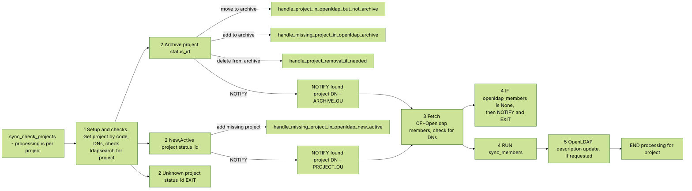

# project_openldap_sync.py

Operation of main function sync_check_projects in **project_openldap_sync.py**

```mermaid
%%{init: {'theme': 'forest', 'themeVariables': { 'fontSize': '20px', 'fontFamily': 'Inter'}}}%%
graph LR;
    A[sync_check_projects - processing is per project] --> B[1 Setup and checks. Get project by code, DNs, check ldapsearch for project]
    B --> C[2 Archive project status_id]
    B --> D[2 New,Active project status_id]
    B --> K[2 Unknown project status_id EXIT]
    C -- move to archive --> E[handle_project_in_openldap_but_not_archive]
    C -- add to archive --> F[handle_missing_project_in_openldap_archive]
    C -- delete from archive --> G[handle_project_removal_if_needed]
    C -- NOTIFY --> H[NOTIFY found project DN - ARCHIVE_OU]
    D --add missing project--> I[handle_missing_project_in_openldap_new_active]
    D -- NOTIFY --> J[NOTIFY found project DN - PROJECT_OU]
    J --> L[3 Fetch CF+Openldap members, check for DNs]
    H --> L[3 Fetch CF+Openldap members, check for DNs]
    L --> M[4 IF openldap_members is None, 
then NOTIFY and EXIT]
    L --> N[4 RUN sync_members]
    N --> Y[5 OpenLDAP description update, if requested]
    Y --> Z[END processing for project]
```

