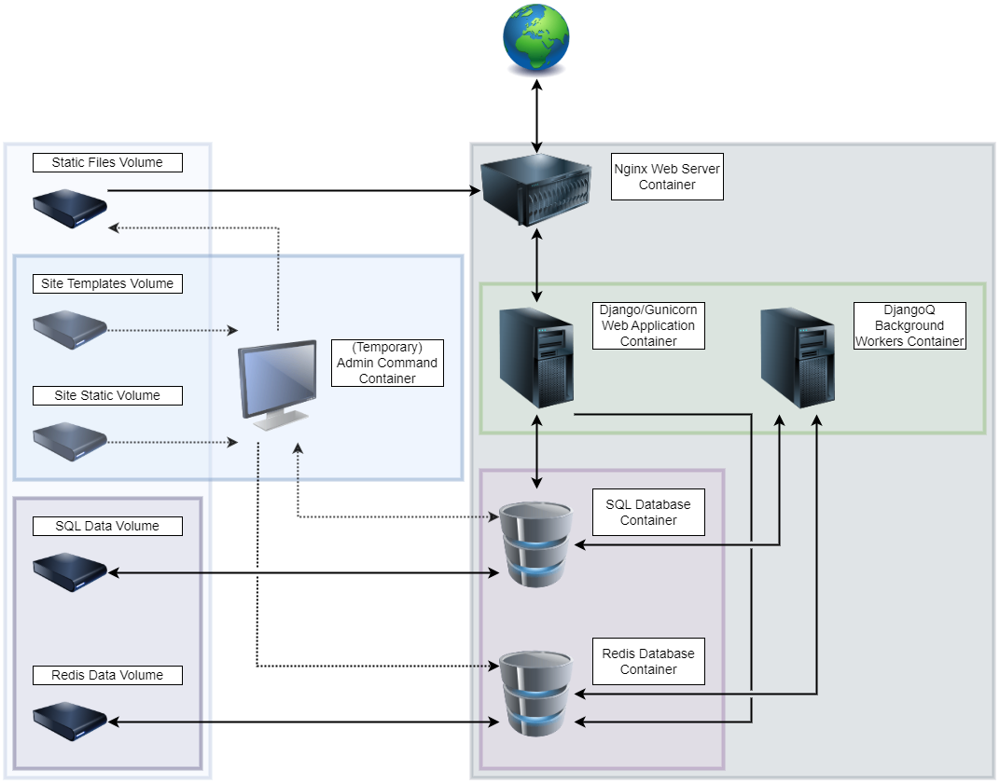

# Containers

ColdFront provides a standard base image when using containers. This image is updated regularly, but its releases do not necessarily correspond with the bleeding edge on the main branch on GitHub or with official releases on PyPI. The official ColdFront image is hosted on [Docker Hub](https://hub.docker.com/r/ubccr/coldfront/tags). The image can also be created from source using the included `Dockerfile` in the root directory of the [repository on GitHub](https://github.com/ubccr/coldfront). The container is configured by default to run Gunicorn workers to serve the web page, but can also be used to run ColdFront management commands and ColdFront's background workers. 

The provided image was designed to maximize ease of use and portability. Therefore, it is most suited to help users trial and develop ColdFront. The image comes pre-configured with everything needed to run any configuration of ColdFront, regardless of factors such as the plugins used, what database is used, or how the rest of the deployment is configured. To maximize performance and security, ColdFront administrators may want to customize and harden the provided image to suit their specific needs before using it in a deployment. 

!!! tip "Container Security"
    Container security is a broad and complex topic that falls outside the scope of this document. Container security best practices will vary based on the specific circumstances of each deployment. [Docker's security documentation](https://docs.docker.com/engine/security/) and the [OWASP container cheat sheet](https://cheatsheetseries.owasp.org/cheatsheets/Docker_Security_Cheat_Sheet.html) are good resources to familiarize yourself with container security. 


The rest of this document will provide guidance on how to use the ColdFront container in common situations. A basic understanding of using the [Docker CLI](https://docs.docker.com/reference/cli/docker/) is assumed. While this document uses Docker for examples, the ColdFront container image should be compatible with any [Open Container Initiative](https://opencontainers.org/) compliant tooling, such as `podman`. If you experience any problems with the provided image not behaving as expected with alternative containerization tools, please open an issue or discussion on GitHub.


## Run and Test ColdFront Using Container 

While running Gunicorn by default is suitable for a production deployment, for testing purposes it is better to use Django's built-in test server. When ColdFront is configured with the setting `DEBUG = True` and ran with the built-in Django test server, static files will also be displayed without the need to configure a separate server such as nginx. With the ColdFront container also connected to a database, most of ColdFront's functionality can be tested using just a single container!

To test ColdFront with a container, a `.env` file containing settings needs to be written. A good minimal configuration for testing is:
```shell
DEBUG=True
CENTER_NAME='University HPC'
PROJECT_ENABLE_PROJECT_REVIEW=False
DB_URL=sqlite:////usr/share/coldfront/coldfront.db
```
which can be saved anywhere on disk, but for this example will be saved to `/tmp/test/coldfront.env`. 

ColdFront will also need to have a relational database configured. The simplest method is to use a sqlite database file on the local machine that will be mapped into the container with a bind mount. Create a location on your local disk where the sqlite database file can be stored, for example `mkdir -p /tmp/test/coldfront/`.

The container can now be ran. The following command specifies the location of the environment variable file, a bind mount that maps a path from the local filesystem to the container's filesystem to store the database, runs the application on port 8000, and overrides the default command to use Django's built-in test server:
```shell
docker run -it --rm --env-file /tmp/test/coldfront.env -v /tmp/test/coldfront:/usr/share/coldfront -p 8000:8000 --name cftest docker.io/ubccr/coldfront:latest coldfront runserver 0.0.0.0:8000
```

The ColdFront web application is now running and should be accessible from `localhost:8000`. While ColdFront is running, it does not yet have any data in it. To populate the database open up a shell in the container:
```shell
docker exec -it cftest /bin/bash
```
which will allow you to run management commands. 

To set up the initial database tables you can run:
 ```shell
 coldfront initial_setup
 ```

A new admin account can be created using: 
```
coldfront createsuperuser
```

A set of pre-configured test data can be loaded into the database using:
```
coldfront load_test_data
```
please see [the installation docs](install.md#loading-the-sample-test-data) for more information on using ColdFront's management commands including the credentials created for the users populated using `load_test_data`. 

!!! warning "`load_test_data`"
    A database that has been configured with `load_test_data` contains insecure user account logins and should never be used in production. The data provided by `load_test_data` is only meant for development. 

## Customizing Coldfront Container

### Extending the Base Image

There are many cases where it might be necessary to have a customized ColdFront container to meet your own needs. These may include:

- increasing container security
- adding custom plugins
- using custom static resources in the image
- configuring a log aggregator
- many other situations!

The easiest way to create a customized ColdFront container is to extend the provided ColdFront image and add your own modifications. 

To create your own image:

1. Start a `Dockerfile` with a `FROM docker.io/ubccr/coldfront:<desired-tag>` directive (if you created the base image locally from a Dockerfile instead of pulling from Docker Hub, you would have to specify the `name:tag` of the local image instead of the Docker Hub URI).
2. Write all the directives necessary to set up your custom modifications. 
3. Close the new Dockerfile with a `CMD` directive to specify what you want the container to run by default. This will override the `CMD` directive of the base image.

The following is an example of a customized image that will run ColdFront using a non-root user for increased security. This custom ColdFront container uses a sqlite database which requires that the process running ColdFront has direct write permissions on the database file. Giving a non-root user direct access to a file stored outside the container's filesystem (since databases should always be stored outside of a container image) requires knowing the path to the directory at build time. 
```Dockerfile
FROM docker.io/ubccr/coldfront:latest

# Create a non-root user and group
RUN groupadd -r coldfrontgroup && useradd -r -g coldfrontgroup -d /app -m -s /bin/false coldfrontuser

# Make sure the mount point for the sqlite directory exists and is owned by the coldfrontuser
RUN mkdir /path/to/sqlite/data && chown coldfrontuser:coldfrontgroup /path/to/sqlite/data

# Make sure coldfrontuser has proper permissions
RUN chmod 770 /path/to/sqlite/data

# Make sure everything runs from /app still
WORKDIR /app

# Run everything in the container as non-root user
USER coldfrontuser

CMD ["put", "your", "command", "here"]
```

 


### Creating a Custom Image from Source

Extending the provided ColdFront image is the best solution when adding or tweaking functionality on the base ColdFront image. However, certain deployments may want to remove functionality or heavily modify the base image itself. These types of changes will be easiest by modifying the source code for the base image to the desired configuration. A common case for doing this is eliminating unused dependencies to reduce the size and attack surface of the container. 

For example, if you are using sqlite for your database, there is no need to have drivers installed in the image to support Postgres or MySQL/MariaDB. You could simply remove the lines which install these dependencies from the provided `Dockerfile`:
```diff
# Dockerfile contents ...
RUN apt update && DEBIAN_FRONTEND=noninteractive apt install -y --no-install-recommends \
        sqlite3 \
        freeipa-client \
-        mariadb-client \
-        postgresql-client

# Dockerfile continues...
-        libmariadb-dev \
-        libpq-dev \
        libssl-dev \
        libdbus-1-dev \
        libldap2-dev \
        libkrb5-dev \
        libglib2.0-dev \
        libsasl2-dev

# Dockerfile continues...
+        --extra oidc 
-        --extra oidc \
-        --extra mysql \
-        --extra pg

# Dockerfile continues...
+        --extra oidc 
-        --extra oidc \
-        --extra mysql \
-        --extra pg
```
and then build from the modified `Dockerfile` using `docker build`. 


## Deploying ColdFront with Containers

### Required Components

Deploying ColdFront with containers requires the following components:


1.  Services:

    1. Container running a web server (nginx)

    2. ColdFront container running a python application HTTP server (such as gunicorn)

    3. ColdFront container running Django-Q cluster background workers

    4. Container running a database server (unless using sqlite)

    5. Container running redis as an in-memory database

    6. (Optional) Temporary ColdFront container used to run management commands

2.  Storage:
    
    1. Volume for storing static files

    2. Volume for the relational database data

    3. Volume for the in-memory/redis data to backup to

    4. Volume/bind-mount for the site-specific templates

    5. Volume/bind-mount for the site-specific static files

### Executing Management Commands

In any deployment it will be necessary to use a ColdFront container to execute admin commands to perform actions such as initializing the database, applying migrations for new updates, and collecting static files. 
While admin commands can be executed from any ColdFront container, a temporary ColdFront container can be spun up whenever admin commands need to be performed. This eliminates needing a container to have access to volumes/mounts unnecessarily and makes it easier to manage an active deployment without interfering with a container already running another service.  

Regardless of which ColdFront container is used to run admin commands, that ColdFront container must have access to the mounts/volumes containing the site-specific static files, site-specific template files, and the regular static-files volume in order to run `coldfront collectstatic`. Most admin commands will also require access to the SQL database container, and some commands will also require access to the redis database container.

### Topology

To help visualize how the various components fit together, the following is a topology diagram of a typical ColdFront deployment using containers:

{width=60%}


### Docker Compose Example

Docker compose is a powerful and convenient way to set up multi-container applications, and can be used to set up a ColdFront deployment as well. The following is an abbreviated example of a docker compose file demonstrating how to set up a ColdFront deployment:
```yaml
services:
  web-server:
    image: nginx:latest
    volumes:
      - static-files-directory:/srv/coldfront/static/

  coldfront-web-app:
    image: docker.io/ubccr/coldfront:latest
    command: ["gunicorn", "--workers", "3", "--bind", ":8000", "coldfront.config.wsgi"]
    env_file:
      - ./coldfront.env 
    depends_on:
      - relational-database
      - in-memory-database

  coldfront-background-workers:
    image: docker.io/ubccr/coldfront:latest
    command: ["coldfront", "qcluster"]
    env_file:
      - ./coldfront.env 
    depends_on:
      - relational-database
      - in-memory-database

  # this container would be ran individually, this is just here for illustration
  # coldfront-admin-commands:
  #   image: docker.io/ubccr/coldfront:latest
  #   command: ["/bin/bash"]
  #   volumes:
  #    - static-files-directory:/srv/coldfront/static/
  #    - /path/to/your/site/templates/locally:/usr/share/coldfront/site/templates
  #    - /path/to/your/site/static/locally:/usr/share/coldfront/site/static

  relational-database:
    image: mariadb:latest
    env_file:
      - ./coldfront.env 
    volumes:
      - relational-database-data:/var/lib/mysql

  in-memory-database:
    image: redis:latest
    volumes:
     - in-memory-database-data:/data

  
volumes:
  relational-database-data:
  in-memory-database-data:
  static-files-directory:
```
         
!!! note "Compose File"
    This docker compose file is provided solely as an example of how docker compose could be used to deploy ColdFront, and to give a text-based description of a ColdFront deployment. This file is not complete or suitable for use without modification. It does not demonstrate the configuration of ColdFront when using plugins. The final version of any configuration file to deploy ColdFront will require deployment-specific modifications.
