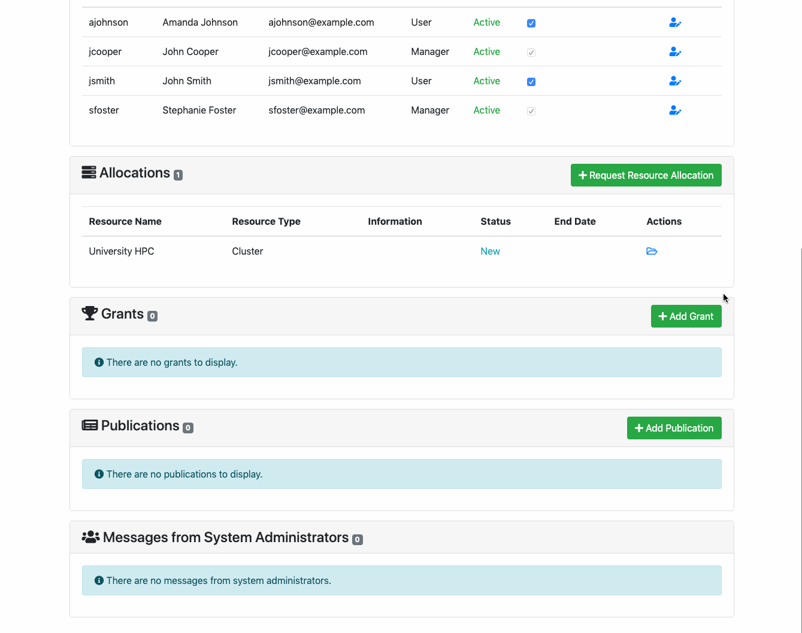
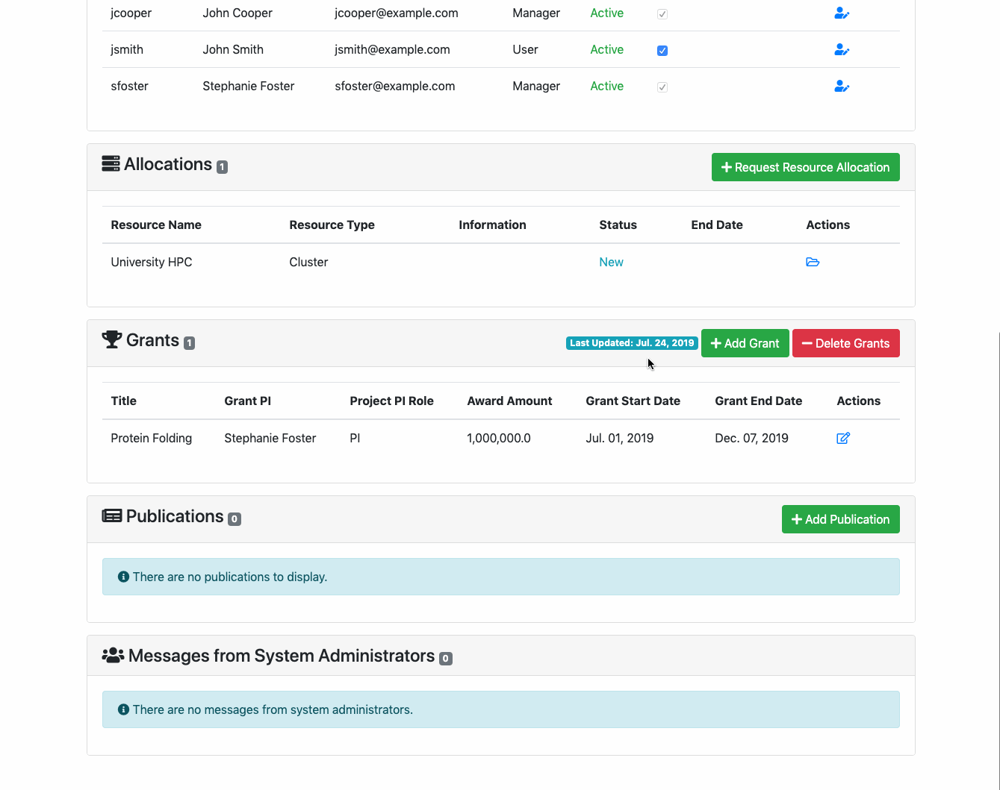
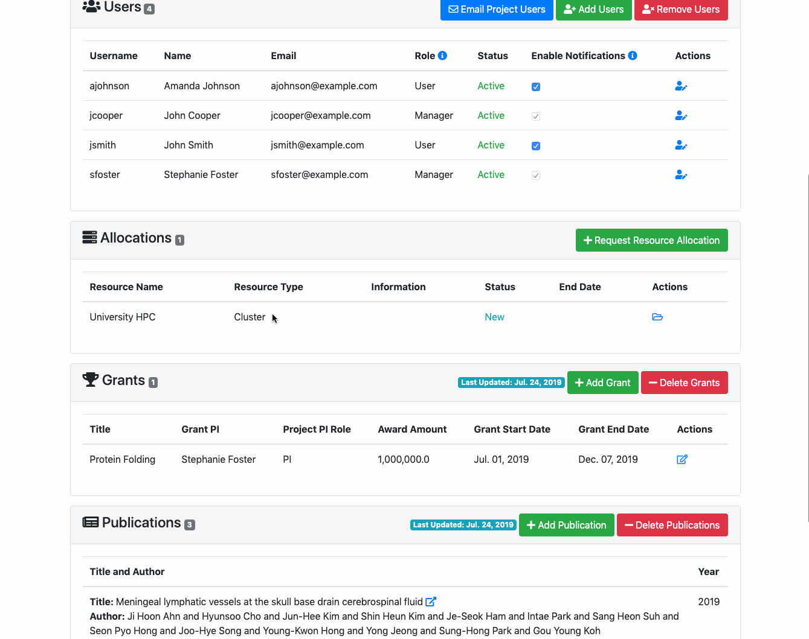

This is a collection of animated gifs demonstrating common functions in ColdFront

[Installation](#installation)  
[Adding Projects](#addproj)  
[Adding Users to Projects](#adduser)  
[Request Allocation](#allocation)  
[Adding Grants](#addgrant)  
[Adding Publications](#addpub)  
[Adding Users to an Allocation](#adduseralloc)  
[Managing an Allocation as an Admin](#allocadmin)  
[Adding a Resource](#addresource)  
[Generate Slurm Association Data](#slurm)  

## Installation

### Adding a Project

### Adding Users

### Requesting an Allocation

### Adding a Grant

### Adding Publications

### Adding a User to an Allocation

### Managing an Allocation as an Admin

### Adding a Resource

### Generate Slurm Association Data

