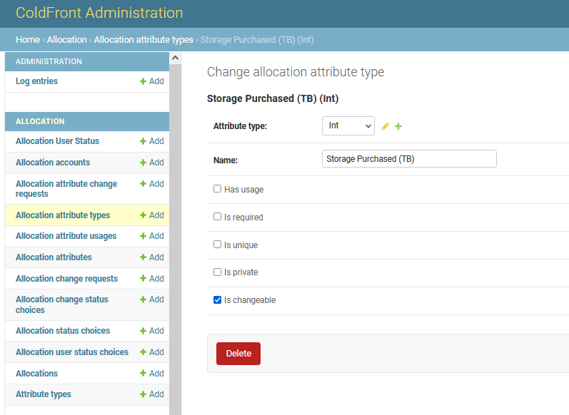
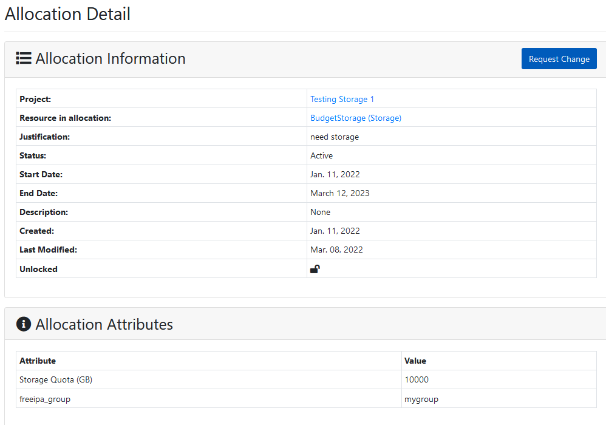
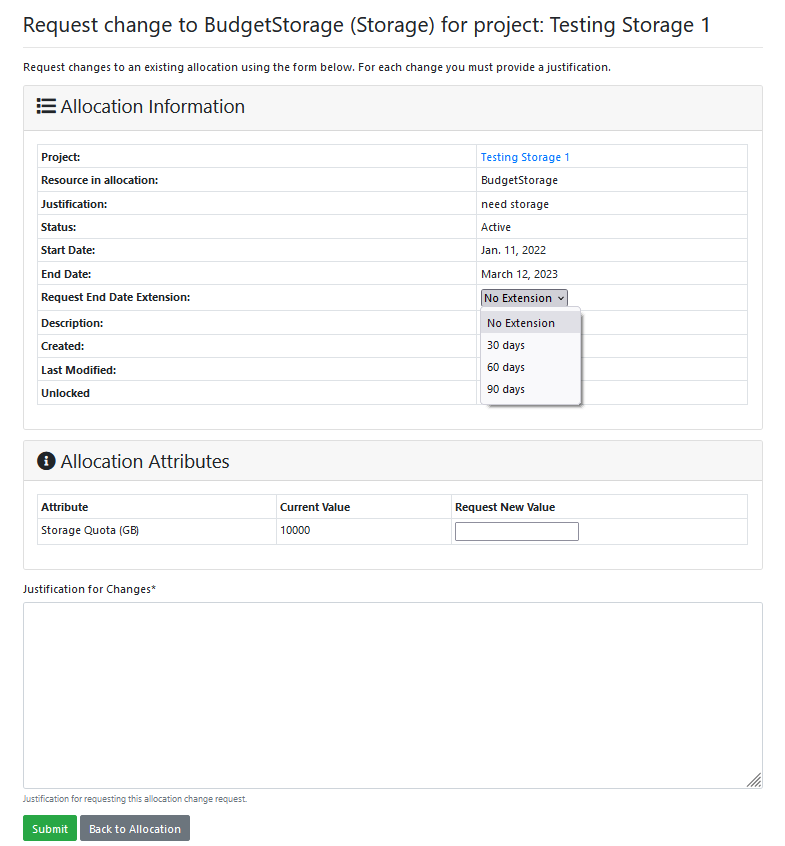
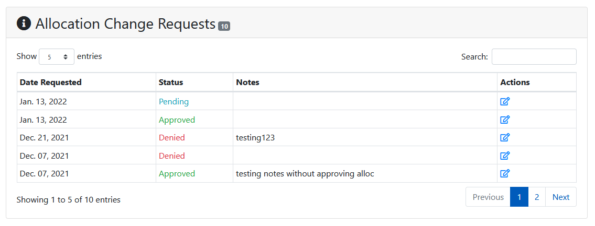
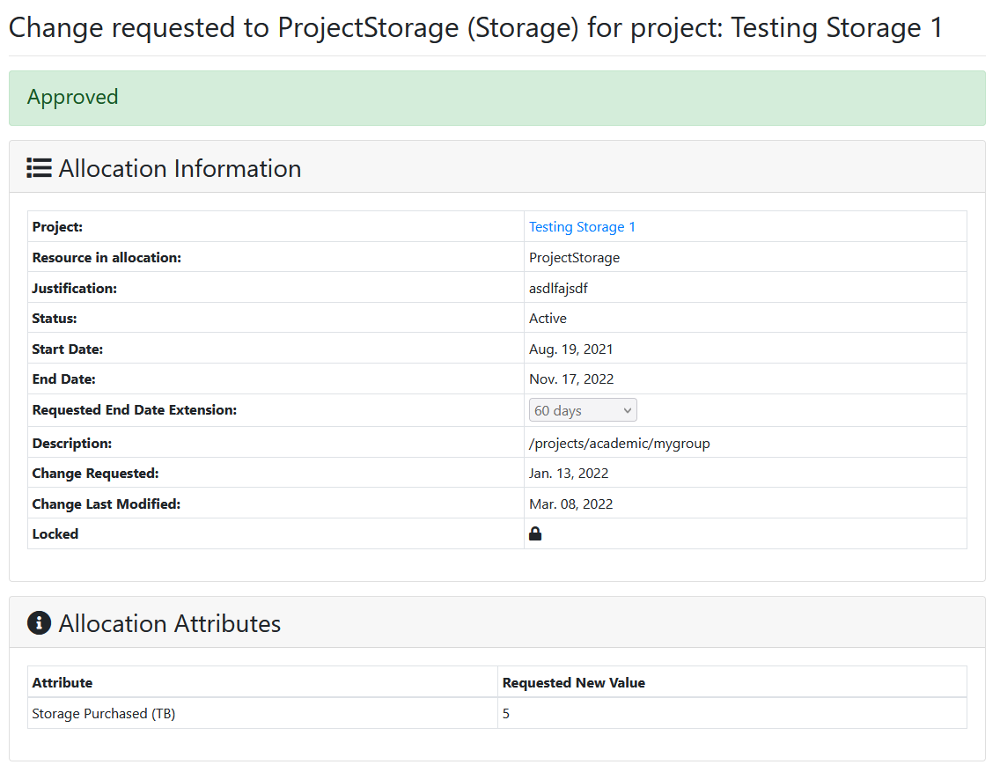
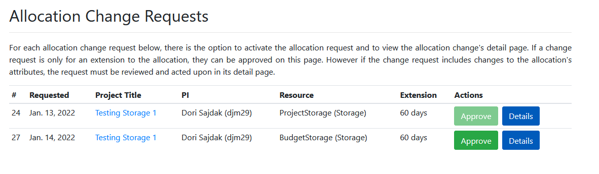
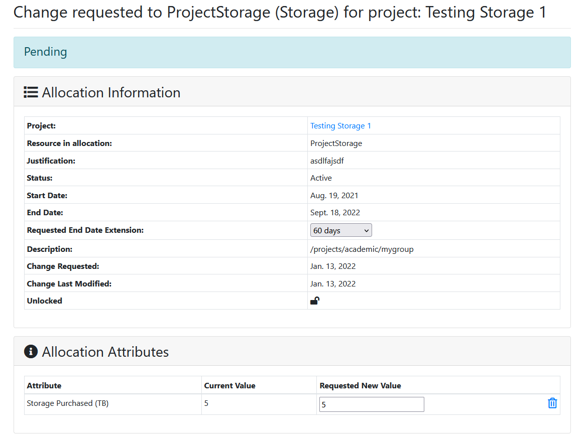
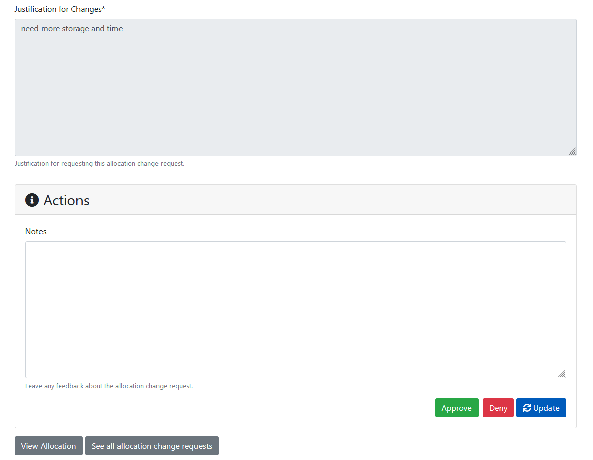

# Allocation Change Requests


## Enable change Requests

By default a new installation of ColdFront will have 'enable change requests' turned on.  For existing installations, once enabled, all new allocations will allow changes.  Existing allocations will need to have this turned on at the allocation level.  To set this for all existing allocations:  

```
$ coldfront shell
Python 3.9.2 (default, Feb 28 2021, 17:03:44)
[GCC 10.2.1 20210110] on linux
Type "help", "copyright", "credits" or "license" for more information.
(InteractiveConsole)
>>> from coldfront.core.allocation.models import Allocation
>>> Allocation.objects.all().update(is_changeable=True)
```

Once changes are enabled on an allocation, the PI/manager on a project will be permitted to request an extension to the allocation expiration date.  If other allocation attributes are marked "changeable" the PI/manager would also be allowed to request a change in value to those attributes (see below).  


## Set attributes to allow changes

Allocation attributes need to be enabled to allow the  PI/manager to request changes to their value.  Administrators won't necessarily want users requesting changes for all allocation attributes.  The primary use case for most centers using allocation changes is to allow users to request changes to storage and CPU quotas.  In the ColdFront Administration Dashboard, administrators should navigate to the 'Allocation' section, click on 'Allocation attribute types' and then on the attribute they want to allow changes for.  To enable changes for this attribute type, check the 'Is Changeable' box:  

  

This will allow a PI/manager to request changes for that type of attribute on allocations that allow changes.  

## Requesting allocation changes  

On the Allocation Detail page the project PI/manager can request changes to allocations by clicking the "Request Change" button.  Note that the allocation must be marked 'changeable' and unlocked for this button to appear.  



 Details about the allocation are displayed and the PI/manager can request a date extension, if desired.  If attributes on this allocation are 'changeable' the requestor will be able to add a new value for the attribute.  A justification for the change is required.  
  

Once submitted, the allocation change request will show as pending on the allocation detail page.  It will also display on the list of Allocation Change Requests for administrators to process.  

## Viewing allocation changes

All users on the allocation, as well as staff and administrators can view all allocation change requests on the allocation detail page:  



Clicking on the icon under the 'Actions' column displays the Allocation Change Request Detail page:

  

Once an allocation change request is submitted, the PI/manager can not modify it.  If alterations are desired, they should submit another change request.

## Managing allocation change requests

ColdFront administrators have access to a list of Allocation Change Requests under the Admin menu.  This is similar to the Allocation Requests list.  



If the change request only requests a date extension, the admin has the ability to approve the request from this list.  Clicking the 'Approve' button will set the allocation status to 'Active' and set the expiration date based on the requested extension time.  If the change request is asking for a modification to an allocation attribute, such as storage quota, the admin will be required to click on the 'Details' button to view the request.  At this point the admin can change the requested end date, any allocation attribute changes, view the justification for the change, add a note on the change request, and approve/deny or update the changes made.  





## Locked Allocations  

If the allocation is locked, the 'Request Change' button will not be available to the PI/manager and changes will not be allowed, even if the allocation is marked "changeable"
