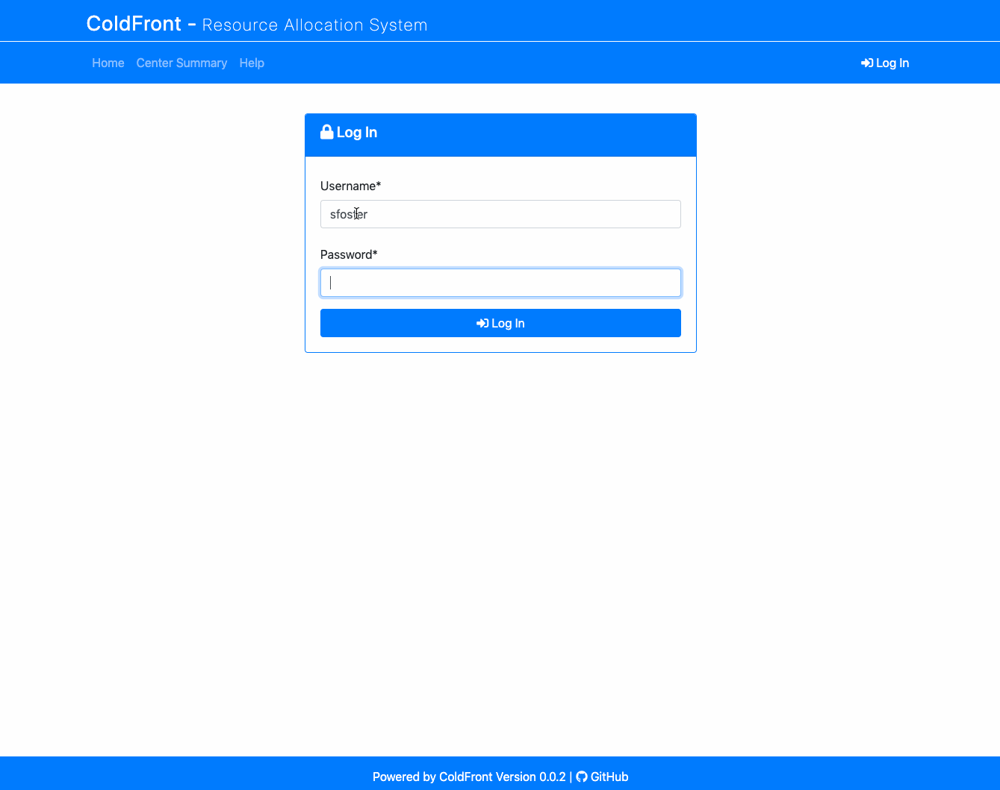
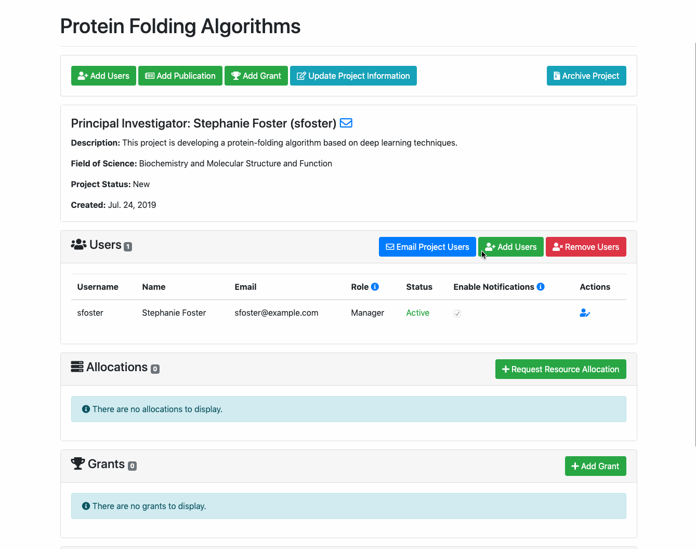
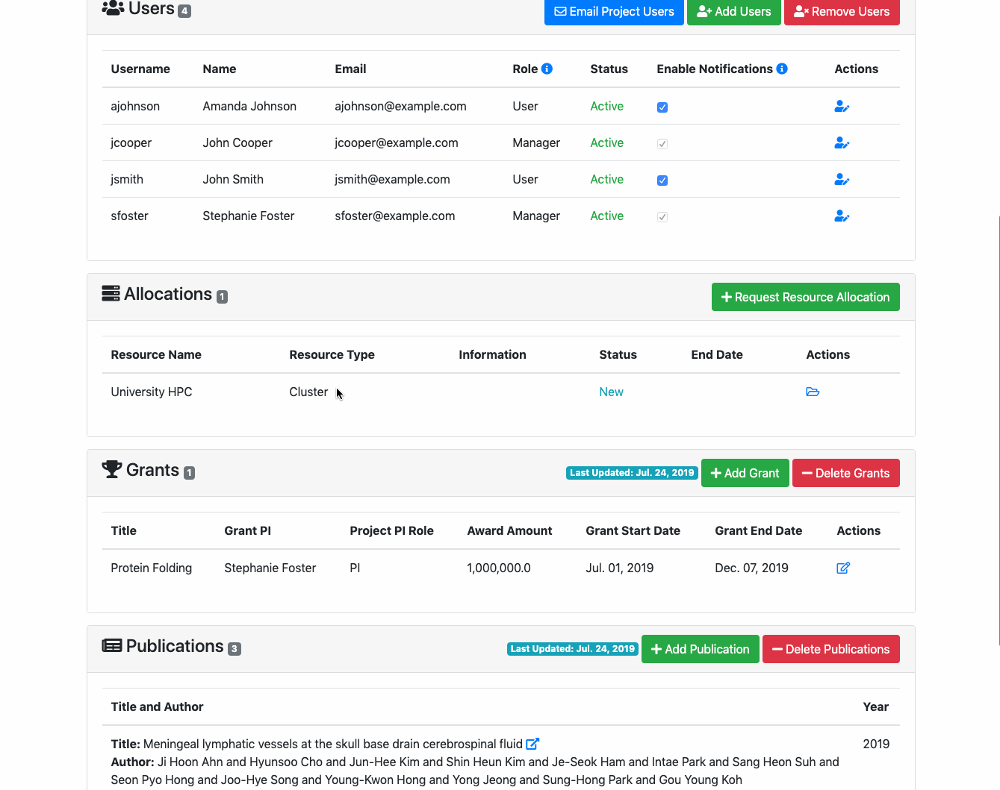
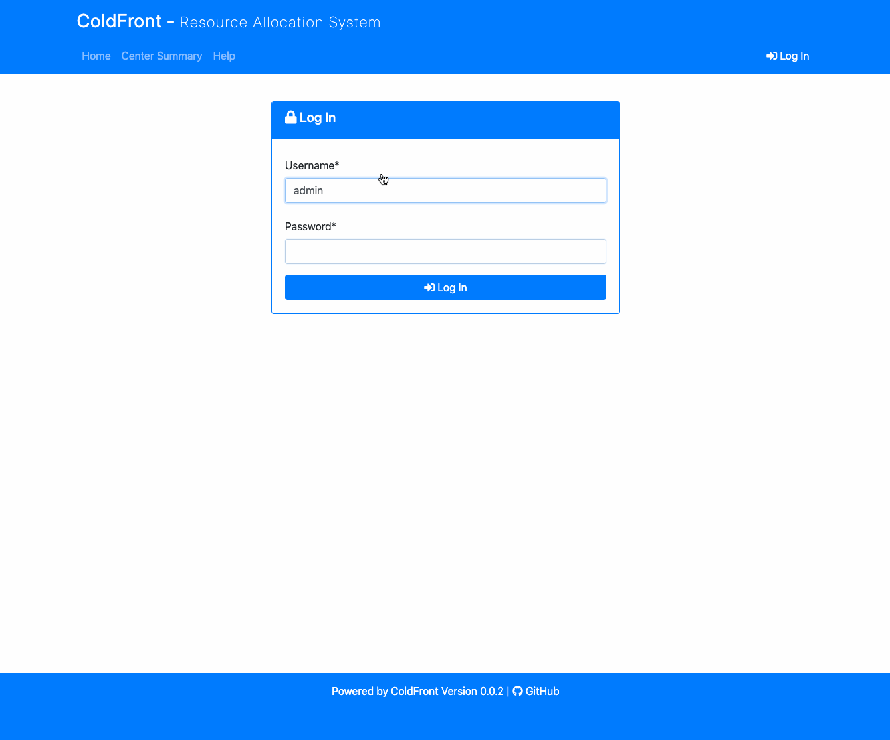

# Animated Demos

This is a collection of animated gifs demonstrating common functions in ColdFront

[Adding a Project](#adding-a-project)  
[Adding Users to a Project](#adding-users-to-a-project)  
[Requesting an Allocation](#requesting-an-allocation)  
[Adding a Grant](#adding-a-grant)  
[Adding Publications](#adding-publications)  
[Adding a User to an Allocation](#adding-a-user-to-an-allocation)  
[Managing an Allocation as an Admin](#managing-an-allocation-as-an-admin)  
[Adding a Resource](#adding-a-resource)  
[Generate Slurm Association Data](#generate-slurm-association-data)  

### Adding a Project

### Adding Users to a Project

### Requesting an Allocation

### Adding a Grant

### Adding Publications

### Adding a User to an Allocation

### Managing an Allocation as an Admin

### Adding a Resource

### Generate Slurm Association Data

