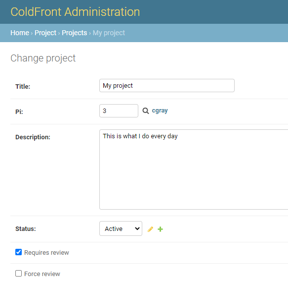
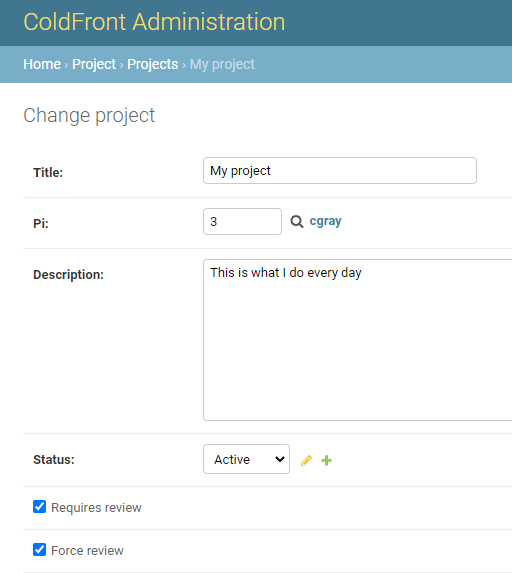

## Project Reviews  

ColdFront provides a way for centers to require PIs to review their projects and provide updates annually.  With the Project Review feature enabled, every project in ColdFront will require a review every 365 days.  The PI will be asked to update project information, verify users on the project, add publications, grants, and research output from the previous year.  When the project review is due, the PI is unable to request new allocations or renew expiring allocations.  The project review process provides the center director a report to view the completed project reviews, easy access to view more detailed project information, and respond to the PI using an editable form email template.  System administrators are able to easily view the status of project reviews when they view pending allocation requests.

### The Project Review Process  

There are two sides of the project review process.  Please see these pages for more info:  
[The PI's Perspective](project_review_PI.md)  
[The Center Staff's Perspective](project_review_staff.md)

### Disable Project Reviews

The project review feature in ColdFront is enabled by default.  To disable it system wide, set PROJECT_ENABLE_PROJECT_REVIEW=False in the [ColdFront configuration](../../config.md).  

### Disable Review Per Project  
You can also disable the review requirement on a project-by-project basis, rather than turning it off system-wide.  In the ColdFront Administration Dashboard, click on the Projects section and click on the project you want to edit.  Uncheck the box next to: "Requires review" and scroll to the bottom to click on the SAVE button.

### Force Review for a Project  

We also have the ability to force a project into the review state. In the ColdFront Administration Dashboard, click on the Projects section and click on the project you want to edit.  Check the box next to: "Force review" and ensure the "Requires review" is also checked.  Scroll to the bottom to click on the SAVE button.

Now when the PI views their project they will find the notification that the project review is due:  

### Who can complete the project review?

The PI or any managers on the project are able to complete the project review process.

### Notifications for Project Reviews  

ColdFront does not send notifications to PIs when project reviews are due.  The PI can not request new allocations or renew expiring allocations when the project review is due so we allow it to remain pending until the PI needs to accomplish one of these tasks.  Because the majority of our allocations have 1 year expirations, our PIs are forced to review their projects annually.  A PI can add/remove users and update project information when a project review is due.  Unlike the allocations requests, we do not prevent them from updating users and we find our PIs will complete the project review when they login to accomplish these tasks.

### Notification of Submitted Reviews  

The email address configured for 'center director' in the ColdFront configuration is notified when a new project review has been submitted.  A link to the pending 'Project Reviews' list is included in the email.  See [email setting configs](../../config.md#email-settings) for more info.

### Changing the length of time between project reviews  

At this time, the length of time between project reviews is hard coded for 365 days.  This can not be changed without altering the ColdFront core code.  We plan to implement this as a configurable setting in the future.
