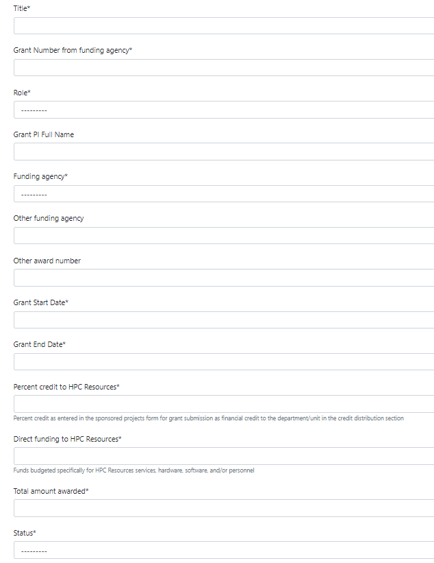
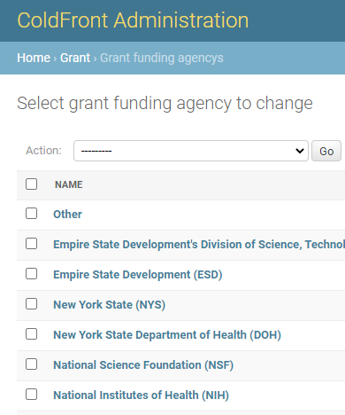
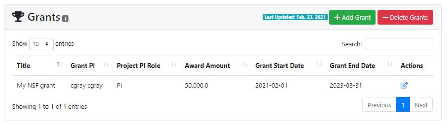
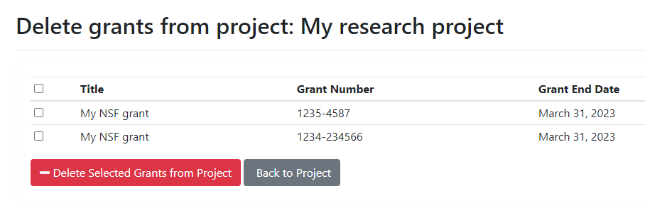
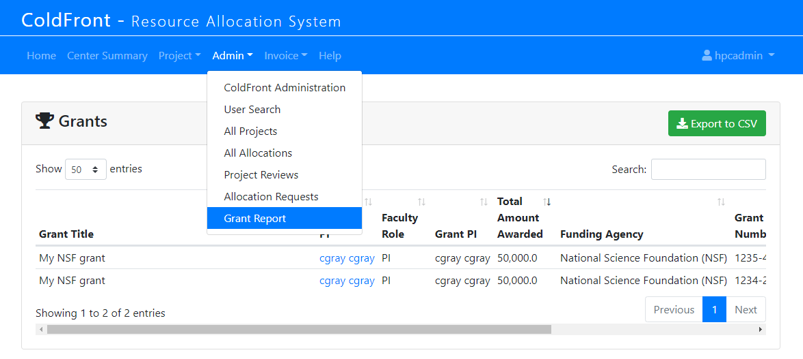

## Grant Information

Grant data is useful to Center Directors for making the case for enabling science at an organization.  How much funding is your organization able to obtain based on having access to your center's HPC resources?  You may ask your PIs to enter all grants they have been awarded or only those for which they need your center's resources.  This is a policy decision and should be communicated to your researchers.  

### Adding Grants

Adding grants is a manual process.  PIs or managers must supply the fields marked with an asterisk.

  

### Grant Funding Agencies

ColdFront comes with a list of example funding agencies.  This list can be modified in the ColdFront Administration Dashboard under Grants - Grant Funding Agencys  
_NOTE: this isn't a typo, this is django pluralizing objects!_

  

### Editing Grants

Grant information on pending or active grants can be edited by clicking on the folder icon next to the grant in the grant list on the Project Detail page  

  

### Deleting Grants

Grants can be deleted by clicking on the 'Delete Grants' button.  A list of all grants in any status are displayed.  

  
No grants are selected by default.  The user can individually select the grant(s) to delete or click on the top checkbox to select them all.  Once the 'Delete Selected Grants from Project' button is clicked, the grant(s) are removed.  This can not be undone.

### Grant Report

System administrators have access to the 'Grant Report' under the Admin menu.  This displays all grants entered in ColdFront and allows the export of the list to a CSV file.  The admin can also use the 'Search' box to search for keywords like PI name.  

  

If you've granted other staff, such as the Center Director, with access to view all grants, the Grant Report option falls under the 'Staff' menu.  See [details about these special permissions here](../roles/director.md)  
