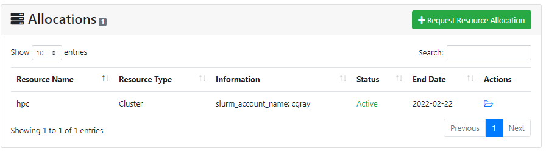
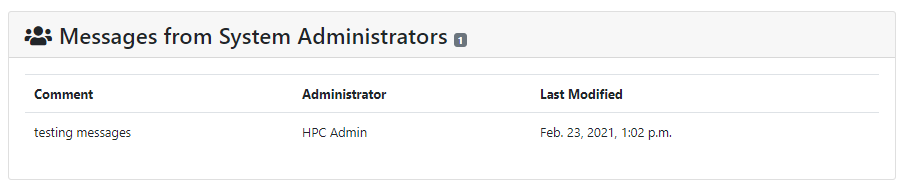

# What are Projects?

Projects in ColdFront are a container that includes users, allocations, publications, grants, and other research output.  At minimum, in order for a user to get access to a resource, there must be a project, a PI, and an allocation to the resource.  Projects can be used to support your center's policies and procedures.  You may want your PIs to maintain only one project with all users and allocations managed with it or you might rather have PIs create new projects for every research project they're working on and request allocations specific to that project.  Whatever your Center's process is, ColdFront will help streamline and automate it.

## Project Details
These fields are created and populated when the project is created:  
- PI (principal investigator or project owner)  
- Project Title\*   
- Project Description\*  
- Field of Science\*  
- Status (new, active, archived)  
- Creation dates  

\* These fields are editable by the PI or manager by clicking the "Update Project Information" at the top of the Project Detail page

**NOTE:** The Field of Science list is pre-populated in ColdFront using the National Science Foundation FOS list.  Centers can edit this using the ColdFront Administration Dashboard, if desired.

### Users
All users with an 'Active' status on the project are displayed in this section.  Administrators can see all users, regardless of status on the project in the ColdFront Administration Dashboard.  PIs and managers on the project can add and remove users.  When adding new users, a list of all allocations on the project is displayed allowing a selection to be made for which allocation(s) the user should be added to.  When removing a user from a project, they are automatically removed from all allocations.  A user must be a member of the project in order to be on an allocation in that project.  More information on users can be [found here](../roles/index.md)

### Allocations
All allocations associated with a project are displayed in this section.  PIs and managers can request new allocations here.  High level details are given about the allocation and the list can be sorted on Resource Name, Resource Type, Information, Status, or End Date.  More detailed Allocation information can be viewed by clicking on the folder icon next to the allocation, under the Actions column.  
  
More details about allocations can be [found here](../allocations/index.md)

### Attributes  
Project attributes by default include examples like Account Number, Billing Address, Project ID, and GroupUsage.  These attributes can be edited by project managers allowing them to provide information to center staff for billing or tracking purposes.  If editing by project managers is not desired, change the project attribute type to `Private`.  This is found in the ColdFront Administration Dashboard under the `Project - Project attributes types` section. The project users will no longer be able to view the attribute and the manager will no longer be able to edit it.  Currently, these attributes are not tied to any backend systems for automation purposes.  

### Grants
All grants entered for a project with the status of 'active' or 'pending' are displayed in this section.  PIs and managers can add and delete grants.  High level details about the grants are provided and the list can be sorted by Title, Grant PI, Grant Role, Award Amount, Grant Start Date and Grant End Date.  More detailed grant information can be viewed by clicking on the folder icon next to the grant.  The PI or manager can edit the grant information here and change the status between 'pending', 'active' and 'archived.'  Once archived it is no longer visible on the project.  
  
More details about grants can be [found here](grants.md)

### Publications
Publications can be added and deleted by PIs or managers on a project.  A DOI search feature provides a simple way to import publications on a project.  For the rare times a publication does not have a searchable DOI, there is an option for adding publication information in manually.  The publication list can be sorted by year of publication and also exported as a CSV file.  Publications added to the list can't be edited.  If changes are required, the publication should be deleted and then re-added.  
  
More details about grants can be [found here](publications.md)  

### Research Outputs
Research Outputs can be anything related to the project work that doesn't fall under the publication section.  This may include magazine or newspaper articles, media coverage, databases, software, or other products created.  This is a free form section that has no requirements or formating restrictions.  Research Outputs added to the list can't be edited.  If changes are required, the incorrect entry should be deleted and then re-added.  
  
More details about research outputs can be [found here](researchoutputs.md)

### Messages from System Administrators
These can be entered from the ColdFront Administration Dashboard.  Select the project and enter the message you want to appear under the "Project User Messages" section.  All users of the project will see this on the Project Detail page.  The PI and all users who have notifications enabled will also receive this in an email.

## Project Views
Access to ColdFront is role based and views are slightly different for administrators, PIs/managers, and users.  Managers are users on a project that have been upgraded by the PI to manager status.  They have all the same access on a project as the PI does.

### PI and Manager View
PIs and managers are able to view and edit most aspects of the project.  They are able to add and delete users from the project and allocation detail pages.  They can change the role of a user to manager or from manager to user.  They can add and delete publications, grants, and research outputs.  They are able to export the list of publications on the project.  They are able to complete the annual project review (if enabled) as well as request new and renew expiring allocations.  

### User View
Users who are not PIs or Managers on a project see a read-only view of the project details.  If a user is on a project but not a particular allocation, they will not be able to see the allocation in the list of allocations on the Project Detail page.  No buttons are visible on this view, like there are on the PI/Manager view.  If a user is on an allocation, they can click to view the allocation detail page in a read-only format.  

### Staff View
A user can only view projects they are on.  However, there is a way to enable Center staff to view all projects.  You may wish to do this for your Center director(s) or other user-facing staff who could benefit from accessing the project information.  More information on the different options for Staff views can be [found here](../roles/staff.md)
