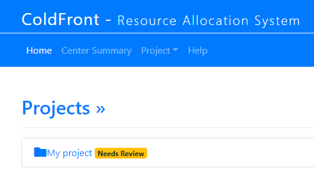
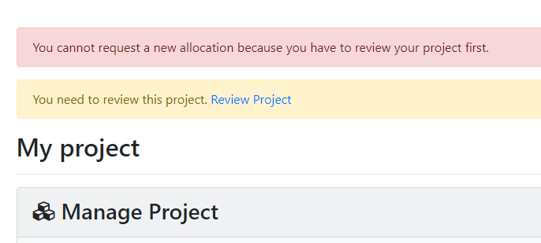
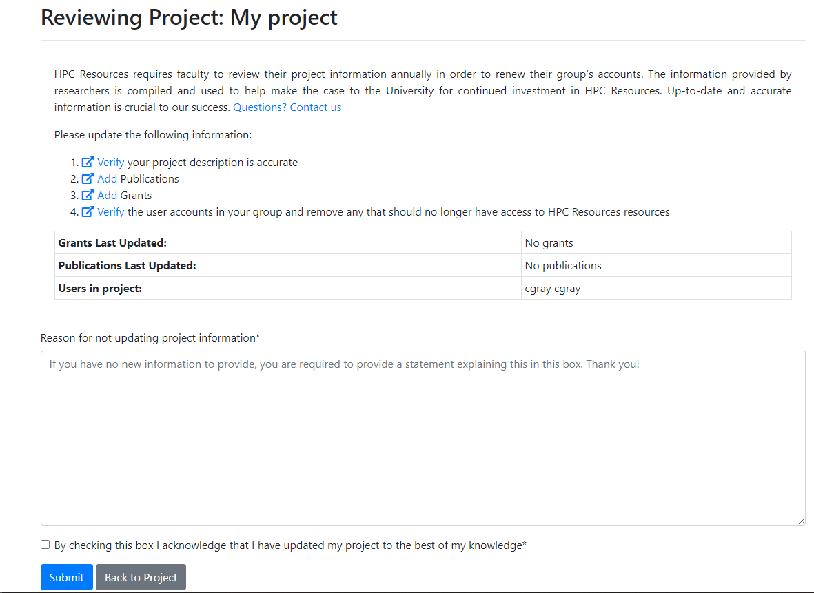
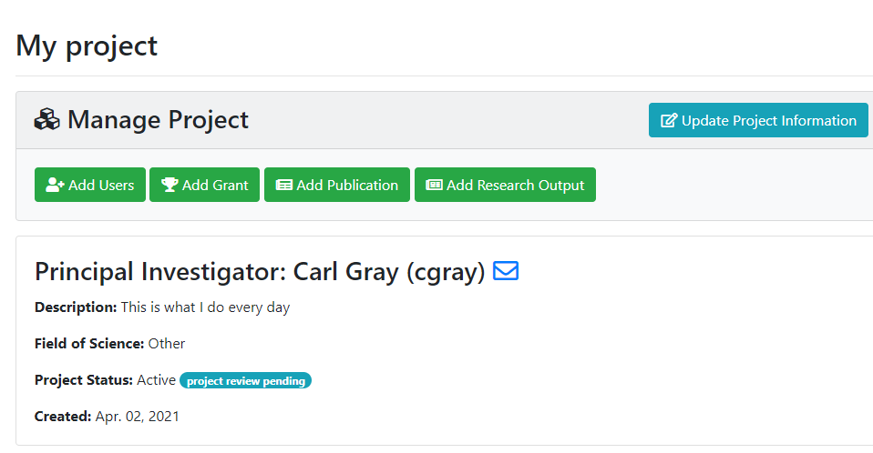

# Project Reviews for PIs  

When a PI logs into ColdFront and their project review is due, they see a banner next to the project name on the home page:  

If they try to request a new allocation or renew an expiring allocation, they will get an error message:  

### Project Review Steps  

The PI or manager of a project must complete the project review once every 365 days.  When they click on the 'Review Project' link they're presented with the requirements and a description of why we're asking for this update:  

The links in each step direct them to different parts of their Project Detail page.  This review page lists the dates when grants and publications were last updated.  If there are no grant or publications or at least one of them hasn't been udpated in the last year, we ask for a reason they're not updating the project information.  This helps encourage PIs to provide updates if they have them.  If not, they provide a reason and this is displayed for the Center Director as part of his/her review process.  

Once the project review page if completed, the PI is redirected to the project detail page and they see the status change to 'project review pending.'  At this point they're able to renew allocations or request new ones.  These can remain pending while the project update information is reviewed by center staff.

