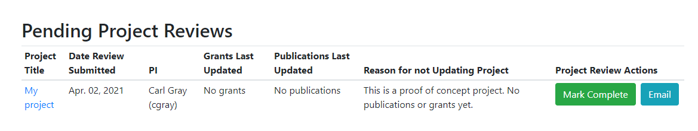
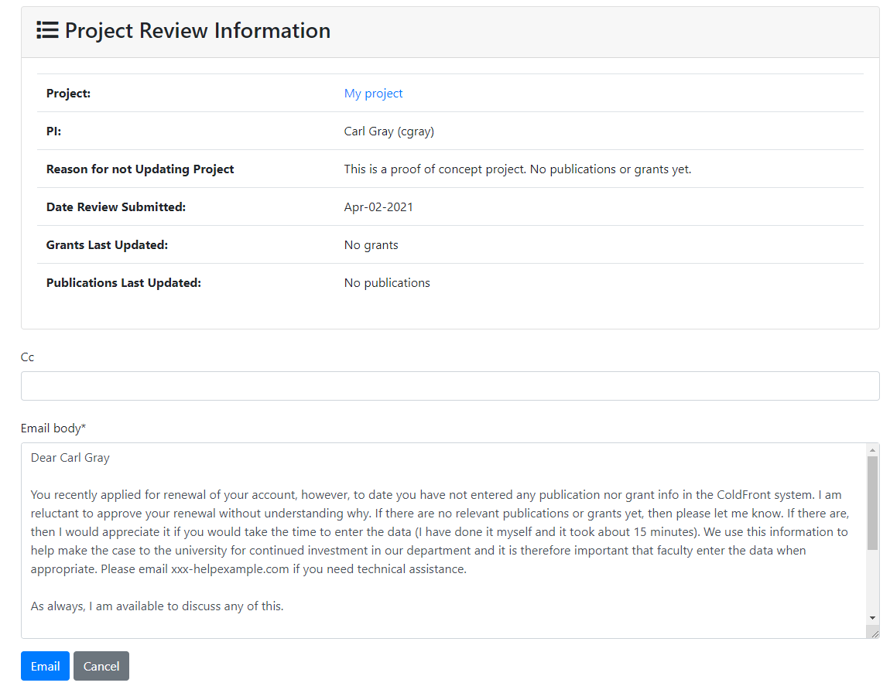

# Project Reviews for Center Staff

The center director has access to the "Project Reviews" page under the 'Admin' menu in ColdFront.  Pending reviews will display here with the following information:  

- Project title - link to the Project Detail page   
- Date review was submitted  
- PI - full name and username  
- Grants last updated date  
- Publications last updated date  
- Reason for not updating project - this must be provided if the grants or publications have not been updated in the last 365 days



If the director is satisifed with the project review and details provided, they can click the "Mark Complete" button.  This resets the review clock and starts the countdown to next year's due date.  It also changes the status displayed for the system administrators or other staff reviewing allocation requests (see below).

If the director is not satisfied with the project update, they can click the 'Email' button to display an editable template email to send to the PI.  A CC field accepts additional email addresses to include on the email.  The project review can remain pending while the director waits for the PI to respond to the email request or update the project details in ColdFront.




### Configuring  these settings  

There are two places to configure these settings for your specific installation.  The email settings should be configured in the [ColdFront environment](../../config.md/#email-settings).  Be sure to set:  
EMAIL_DIRECTOR_EMAIL_ADDRESS - Email address for director  
EMAIL_PROJECT_REVIEW_CONTACT - Email address(es) for additional staff contacts, optional  

The text for the template email should go in the local_settings.py file to override the default template.  It would look something like:  

```
#------------------------------------------------------------------------------
# My coldfront custom settings
#------------------------------------------------------------------------------
EMAIL_DIRECTOR_PENDING_PROJECT_REVIEW_EMAIL = """
I noticed through the Coldfront allocation portal that you applied for renewal of your HPC
account.  However, to date there is no new publication or grant info entered in the last year.  
If there are no relevant publications or grants – that is fine.  If there are, we would greatly
appreciate it if you enter the data.  Please note that for grants we are interested in externally
funded awards.

Our primary mission is to enable research and this info helps us make the case for continued
investment in HPC by the university.  Your support and understanding is greatly appreciated.   
Thanks in advance for your consideration.

As always, I am available at any time to discuss.

Sincerely,
HPC Center director
director@example.com
555-555-5555
```
The local_settings.py file should be in the ColdFront installation directory, likely /etc/coldfront

!!! Tip  
    After updating email configuration settings you will need to restart the coldfront-workers service.  