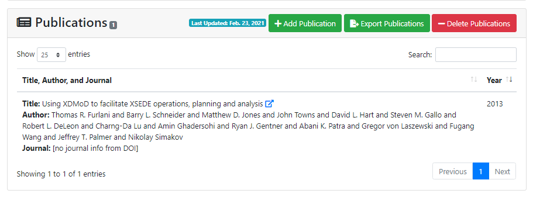
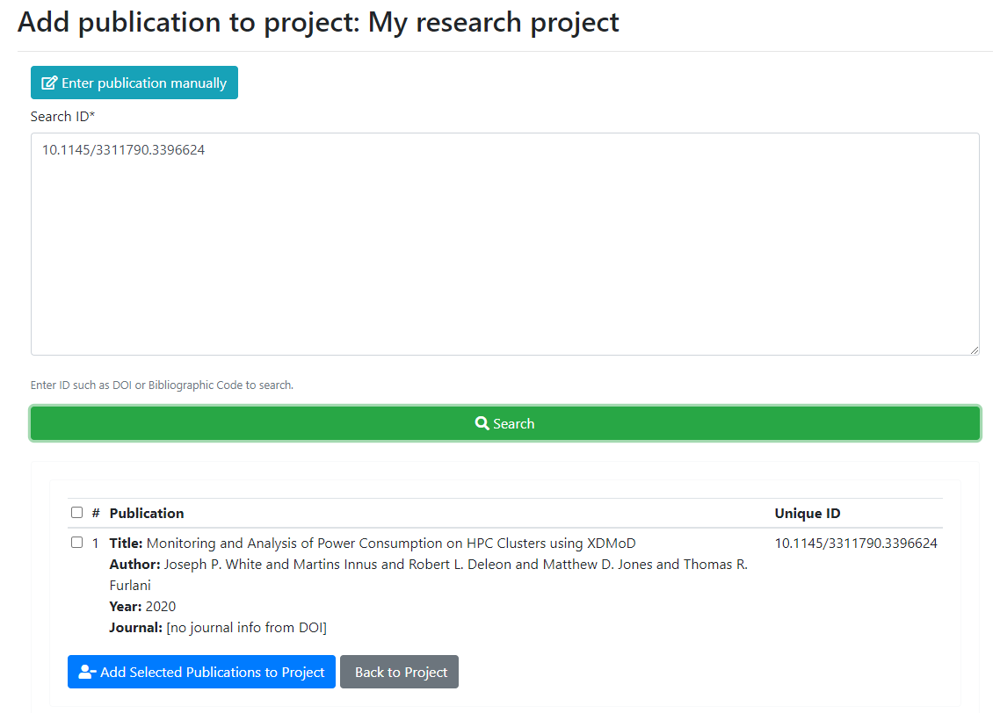
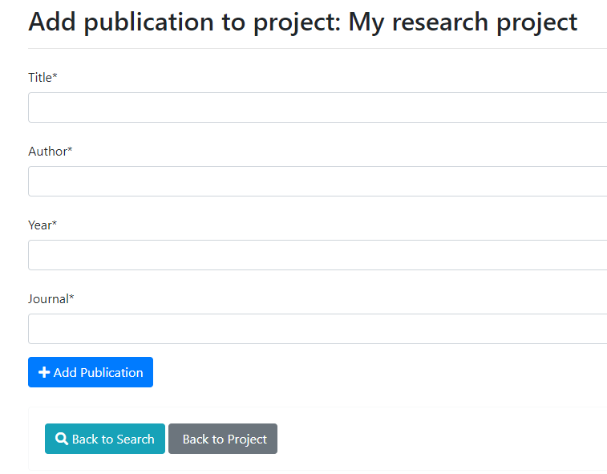
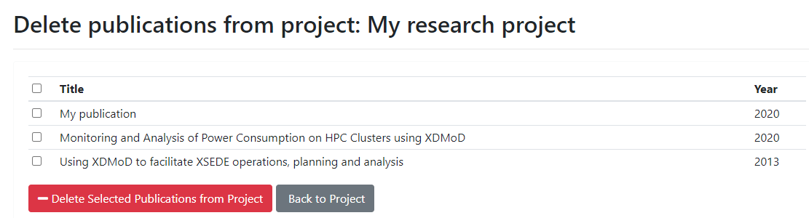
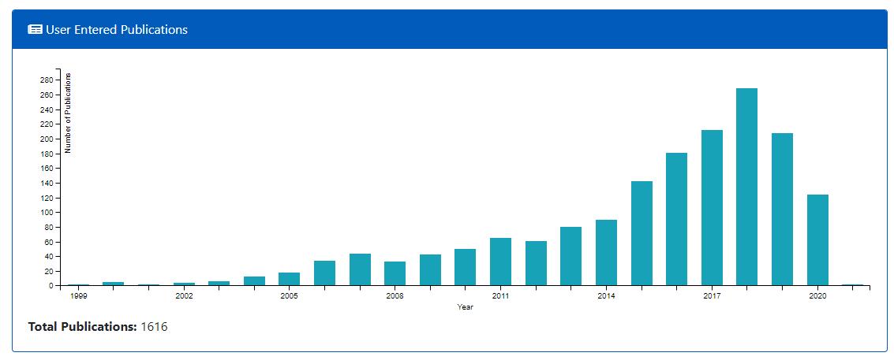

## Publication Information

Publications can be added to a project by the PI or manager.  Publications can be uploaded using a DOI number or they can be entered in manually.  PIs and managers can remove publications they no longer wish to have on their project and export the full list or a selection of the publications to a CSV file.  Center directors and system administrators are able to access the list of all publications added in ColdFront.  The Center Summary contains summary information about the publications and is available to logged in as well as non-authenticated users.

### Adding Publications using DOI Search

  

After clicking the 'Add Publication' button, enter the DOI number(s) in the search box and click the Search button.  Multiple DOIs should be entered on separate lines.

  

To add the publication found, click the checkbox and then the "Add Selected Publications to Project" button.

### Adding Publications Manually

After clicking the 'Add Publication' button on the Project Detail page, click the 'Enter publication manually'  The PI/manager can then enter basic details about the publication: title, author, year, and journal name.  These fields are all required.  Once complete, click the 'Add Publication' button to add to the project.

  

### Deleting Publications

To remove a publication, click the 'Delete Publications' button and a list of all publications on the project will be displayed.

  

No publications are selected by default.  The user can individually select the publications to delete or click on the top checkbox to select them all.  Once the 'Delete Selected Publications from Project' button is clicked, the publication(s) are removed.  This can not be undone.

### Exporting publications from a project

PIs and managers can export the full list, or a selected subset, of publications from the project.  After clicking the "Export Publications" button, a list of all the publications are displayed.  The full list is automatically selected.  The user can uncheck the 'all' checkbox and select only those desired.  After clicking the 'Export Selected Publications from Project' button, a CSV file is generated for download.

  

## Center Publications Summary  

The Center Summary provides a graph of total publications entered into ColdFront by publication date.  This chart is available to both logged in users and those not authenticated

