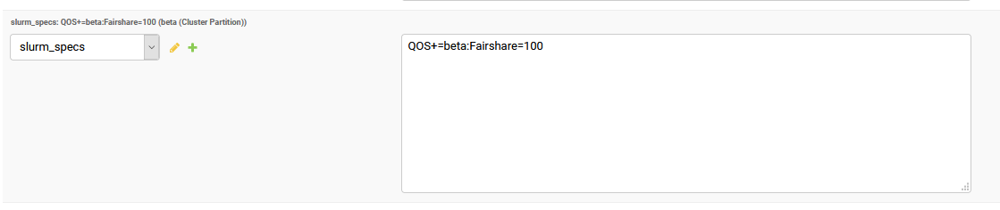
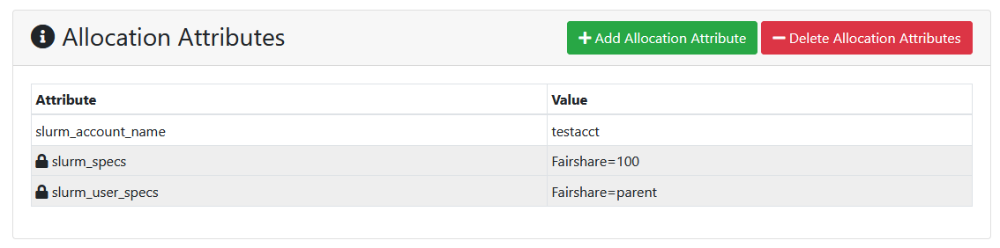

# Cluster Partition Resources

There may be a time when you want to allow PIs to request allocations for a single partition in a cluster, rather than for the whole cluster.  Many centers provide options for PIs to buy into a condo cluster environment.  This may be where the center provides the equpiment and PIs buy a fraction of it or where PIs purchase equipment and the center manages it.  For this purchase, we have a resource type in ColdFront called 'Cluster Partition'

### Use Case
At the University at Buffalo, we allow faculty to purchase nodes that we manage in our Slurm environment.  They have some requirements to follow that allow us to manage them along with the rest of our general use clusters.  Each faculty that buys equipment gets their own partition in the 'faculty' cluster.  Even if it's just one node, that partition is available to the PI's group all the time.  Whenever they're not using it, other users are allowed to 'scavenge' the idle CPUs.  This is accomplished with [Slurm's job preemption](https://slurm.schedmd.com/preempt.html)  

In ColdFront we setup each partition of the faculty cluster as a separate resource.  We restrict the ability to request allocations for that resource to the PI owner and any other PIs he/she may give permission to.  This means that only those PIs will see the resource in the drop down list when request a new allocation.

### The Setup

When creating the resource in the ColdFront admin interface, we choose:
- **Resource Type:**  Cluster Partition   
- **Parent Resource:** Faculty cluster  
- **Is allocatable:** check  
- **Name:** name of partition (this example is 'beta')  
- **Is public:** uncheck
- **Allowed groups/users:**  Select users and/or groups that should be able to request allocations for this resource  
Under Resource Attributes, we add the "slurm_specs" attribute.  We control our access to partitions using Slurm QOS settings.  So if a user does not have the QOS value associated with the partition, they can not submit jobs to it.  We also set the Fairshare value for the account here as it will not be inherited from the main (parent) cluster.  



Looking at the slurm configuration for this partition we see:  

```
PartitionName=beta Nodes=cpn-p27-11-01,cpn-p25-[04-19] MaxTime=720:00:00 DefMemPerCPU=2666 Priority=100 AllowQOS=beta QOS=beta
```

### The Allocation

Create an allocation for this resource, set the status to 'Active' and set the Allocation Attributes the same way you would for a Cluster resource.  



Any accounts on an active allocation for this resource will get the QOS=beta added to their slurm association and they'll be able to run jobs on the partition.  We see this when we run the slurm plugin:  

```
coldfront  slurm_dump -c faculty -o ~/slurm_dump
Writing output to directory: ~/slurm_dump
(venv) [djm29@cld-coldfront-prod ~]$ sacctmgr load file=~/slurm_dump/faculty.cfg
For cluster faculty
 Added QOS                     for Cluster faculty    +normal,+scavenger
 No parent given creating off root, If incorrect specify 'Parent - name' before any children in your file
 Changed fairshare             for Account pkw2       2147483647 -> 100
Accounts
      Name                Descr                  Org                  QOS
---------- -------------------- -------------------- --------------------
  testacct             testacct             testacct
---------------------------------------------------

Account Associations
   Account   Par Name     Share   GrpTRESMins GrpTRESRunMin       GrpTRES GrpJobs GrpJobsAccrue  GrpMem GrpNodes GrpSubmit     GrpWall   MaxTRESMins       MaxTRES MaxTRESPerNode MaxJobs MaxSubmit MaxNodes     MaxWall                  QOS   Def QOS
---------- ---------- --------- ------------- ------------- ------------- ------- ------------- ------- -------- --------- ----------- ------------- ------------- -------------- ------- --------- -------- ----------- -------------------- ---------
  testacct       root       100                                                                                                                                                                                                         +beta
--------------------------------------------------------------

User Associations
      User    Account     Share   GrpTRESMins GrpTRESRunMin       GrpTRES GrpJobs GrpJobsAccrue  GrpMem GrpNodes GrpSubmit     GrpWall   MaxTRESMins       MaxTRES MaxTRESPerNode MaxJobs MaxSubmit MaxNodes     MaxWall                  QOS   Def QOS
---------- ---------- --------- ------------- ------------- ------------- ------- ------------- ------- -------- --------- ----------- ------------- ------------- -------------- ------- --------- -------- ----------- -------------------- ---------
  ccrgst72   testacct    parent                                                                                                     
     djm29   testacct    parent                                                                                                     
--------------------------------------------------------------

sacctmgr: Done adding cluster in usec=363097
Would you like to commit changes? (You have 30 seconds to decide)
(N/y): y

```
Now look at the user's slurm assocations:  

```
sacctmgr show user ccrgst72 -s list format=cluster,user,account,qos%40
   Cluster       User    Account                                      QOS
---------- ---------- ---------- ----------------------------------------
   faculty   ccrgst72   testacct                             beta,normal
```
This user can now submit jobs to the beta partition in the faculty cluster, but not to the other partitions in that cluster.  

### Alternatives  

This is just one way to setup slurm and ColdFront to provide PIs with allocations for portions of a cluster resource.  Contact us if you have another use case and need help determining how to configure it in ColdFront.
