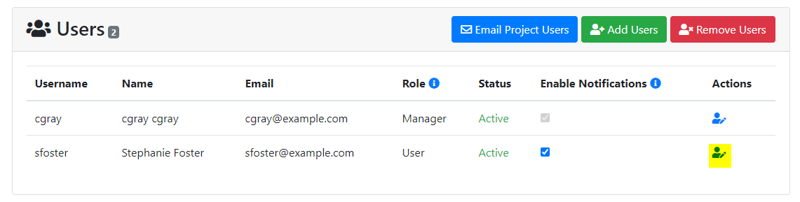
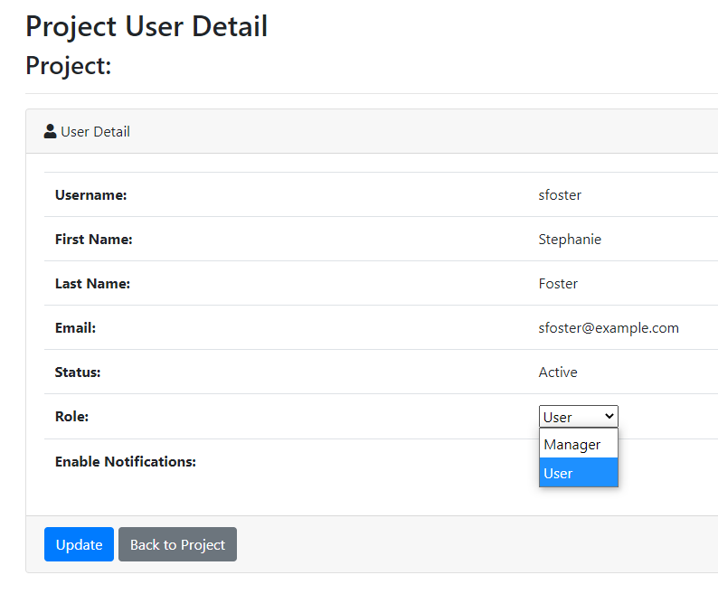

## Manager Role

PIs or project owners can upgrade users on their project to the 'manager' role.  This provides the user with the same access and abilities as the PI.  

To change a user's role to 'manager' click on the edit icon next to the user's name on the Project Detail page:

Then toggle the "Role" from User to Manager:

**Make sure to click the 'Update' button to save the change.**

### Disabling Notifications for Managers

PIs are also have the 'Manager' status on a project.  Managers can not turn off their notifications.  This ensures they continue to get allocation expiration notification emails.  If the PI insists on turning this off, the system administrator can disable notifications for a user in the ColdFront Administration Dashboard.
