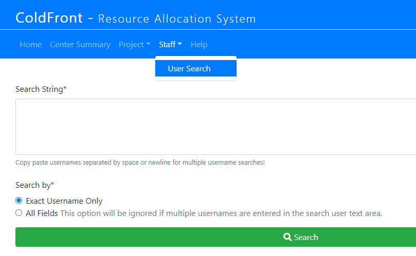
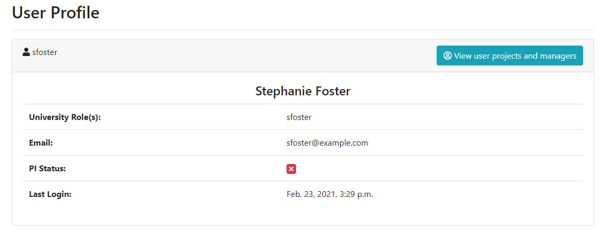
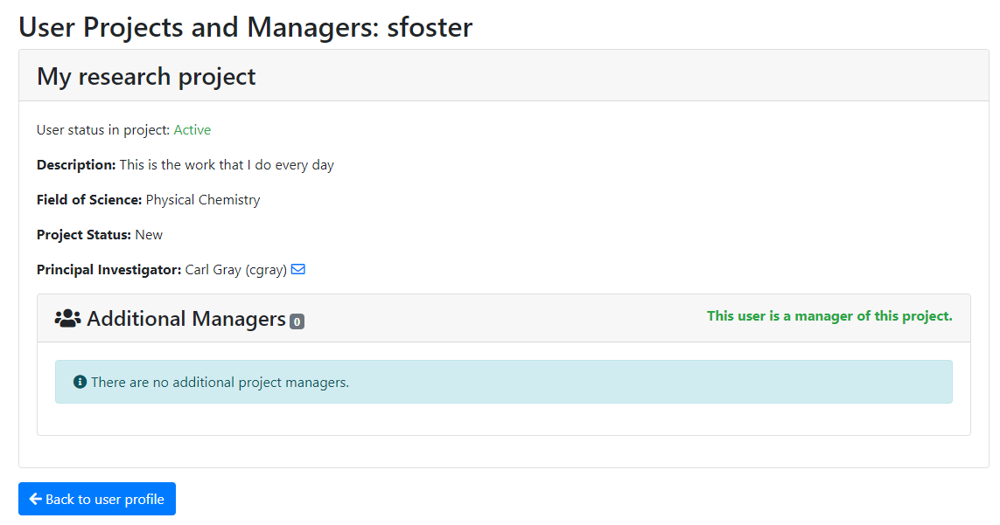
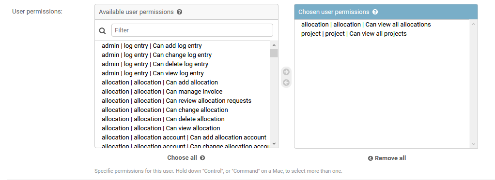
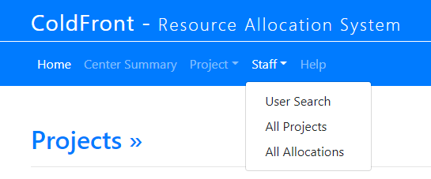
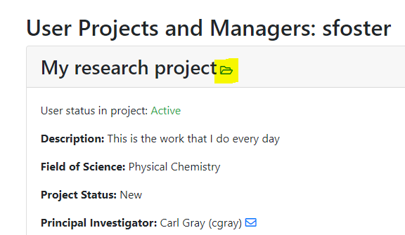

## Staff Access

A user can only view projects they are on.  However, there is a way to enable Center staff to view all projects.  You may wish to do this for your Center director(s) or other user-facing staff who could benefit from accessing the project information.

Marking a user with staff status gives them access to the User Profile feature and displays the Staff menu:

A staff member can search for any user in the system and see details about the user account such as "University Role" (list of unix groups), email address, whether or not the user is PI, and the last time they logged into ColdFront :

By clicking on the "View user projects and managers" they get a list what project(s) the user is a member of.  If the user is a manager or a PI on a project, it is labeled as such:

To enable staff status, go to the Users section of the ColdFront Administration Dashboard and click on the username:

  
**Make sure to SAVE the change at the bottom right of this page.**

If you would also like the staff member to be able to view all projects and/or all allocations, you can provide those permissions in the same location - while editing the user:

  

From the list of "available user permissions" double click on "allocation|allocation|Can view all allocations" and "project|project|Can view all projects"  
**NOTE:**  Though it is possible to give a staff member access to view all projects but not all allocations, we do not recommend this.  The staff member will see nothing under the "Allocations" section of the Project Detail page which may be confusing.  
**Make sure to SAVE the change at the bottom right of this page.**

Once this is done the staff member will now see the "Projects" and "Allocations" options on the Staff Menu and have additional capability on the User Profile page.

  

Notice there is now a folder icon next to the project name.  When clicked, this takes the staff member to that project's detail page:

The staff member can also choose to search "All Projects" or "All Allocations" just as admins do.  However, the allocation and project detail pages are displayed in a read-only view for staff members.  

### Give Staff Access to Review Allocation Requests

In addition to the above permissions, add 'allocation|allocation|Can view all allocation requests' to allow the staff member to see the pending allocation requests menu.  This will display under the 'Staff' menu.  

### Director and Center Administration Staff
You may wish to provide the director of your center, or other administrative-level staff, additional permissions to view and access parts of ColdFront that you would not want to provide to other staff members.  More info on configuring these types of permissions can be [found here](director.md)  

### Billing and Invoice Staff
There are additional permissions you need to provide to staff members responsible for billing or whom you want to have access to view invoices.  If you wish to keep this separate from staff who can view all projects and allocations, you are able to.  See this [info about billing permissions](billing.md)
