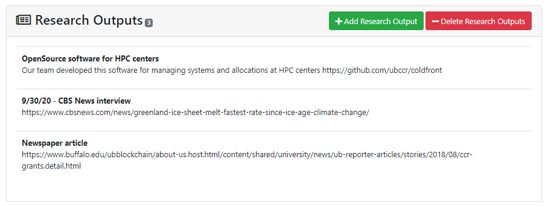
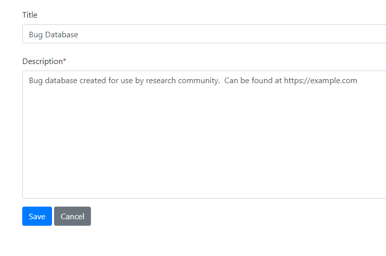
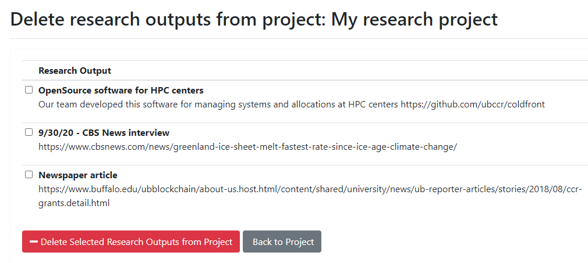
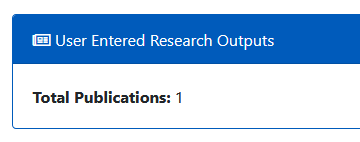

# Research Outputs

Research Outputs can be anything related to the project work that doesn't fall under the publication section.  This may include magazine or newspaper articles, media coverage, databases, software, or other products created.    Research Outputs added to the list can't be edited.  If changes are required, the incorrect entry should be deleted and then re-added.

### Adding Research Output  

The PI or manager can add new data but clicking the "Add Research Output" button on the Project Detail page.  This is a free form section that has no requirements or formatting restrictions.

### Deleting Research Output

To remove a research output entry, click the 'Delete Research Output' button and a list of all entries on the project will be displayed.

  

No entries are selected by default.  The user can individually select the research output entry to delete or click on the top checkbox to select them all.  Once the 'Delete Selected Research Outputs from Project' button is clicked, the entry/entries are removed.  This can not be undone.

### Center Summary - Research Output

The Center Summary provides a total of user submitted research output entries.  This information is available to both logged in users and those not authenticated.  Currently there is no other way to view this information.  

