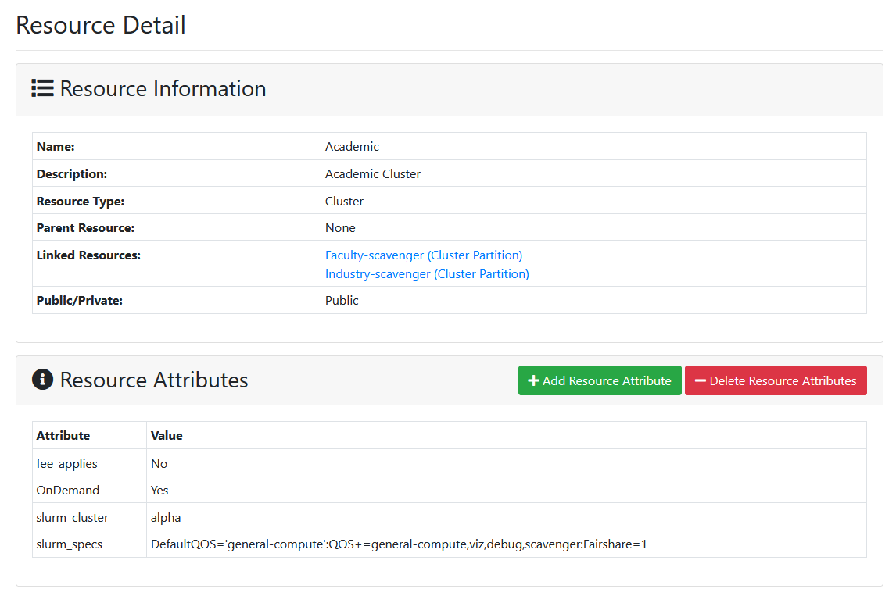
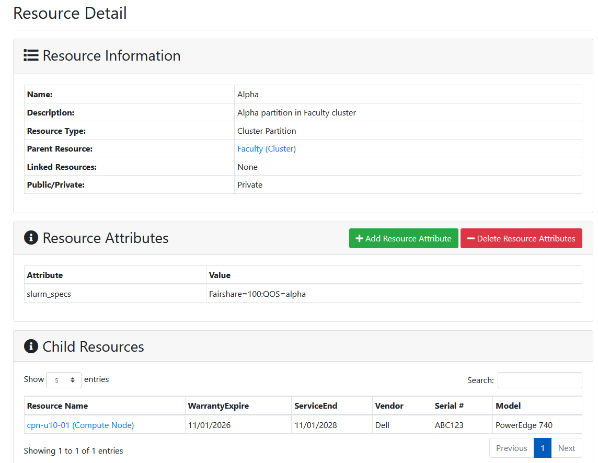
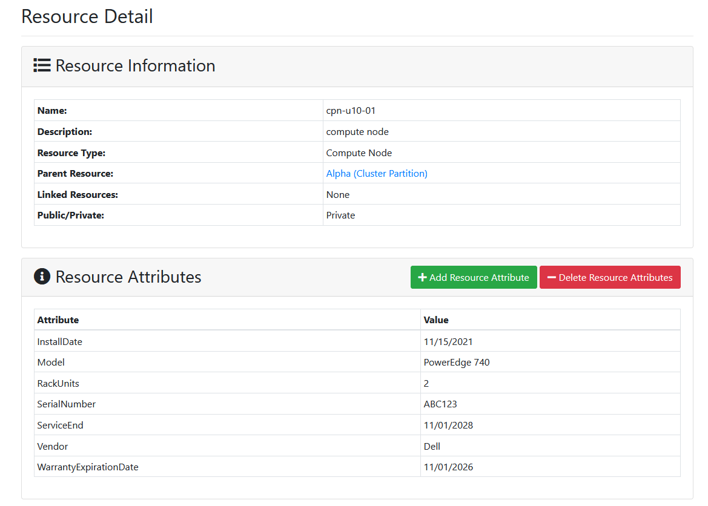

# Resource Details
Resource Detail pages are available in the ColdFront UI and are similar to Allocation Detail pages.  Users can access a resource detail page either from the "All Resources" menu option or by clicking on the resource name on an allocation detail page.  

Users will see a read-only view of the resource, including the resource type, parent/child resources, linked resources, and resource attributes.  System administrators have the ability to add and remove resource attributes, as displayed in the imnage above.  

If a resource has child resources, they will be displayed on the resource detail page along with a subset of their resource attributes:  

In this example, we have a cluster partition resource that is a child of the "Faculty" cluster resource.  The cluster partition has child resources that are compute node resources.    

In order to allow users to see the details of these resources, we allow all users to view all resources.  PIs will not necessarily have the option to request allocations for all of these resources.  Some resources are not 'allocatable' such as a compute node within a partition or the access to some resources may be restricted to a specific user or group.  However, we do allow all users logged into ColdFront to view all resources, should they want to.  
