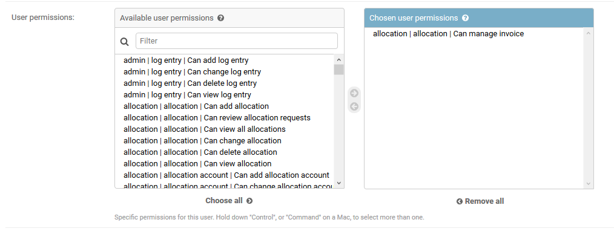
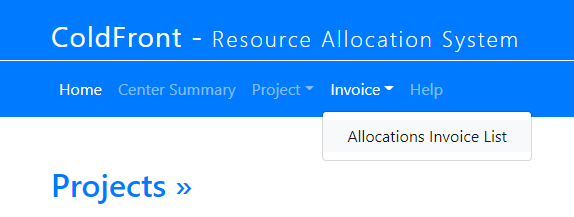

### Billing Staff
In ColdFront you can provide center staff members access to the 'Invoice' menu by adding permissions on their account.  You do NOT have to check the "Staff Status" checkbox, if you do not want the user to have access to the 'Staff' menu.  To grant access to the 'Invoice' menu, select the username in the ColdFront Administration Dashboard under 'Users' and grant the "allocation|allocation|Can manage invoice" permissions  

  
**Make sure to SAVE the change at the bottom right of this page.**

When the user with these permissions logs in, they will see the 'Invoice' menu and be able to interact with the invoices:

  
