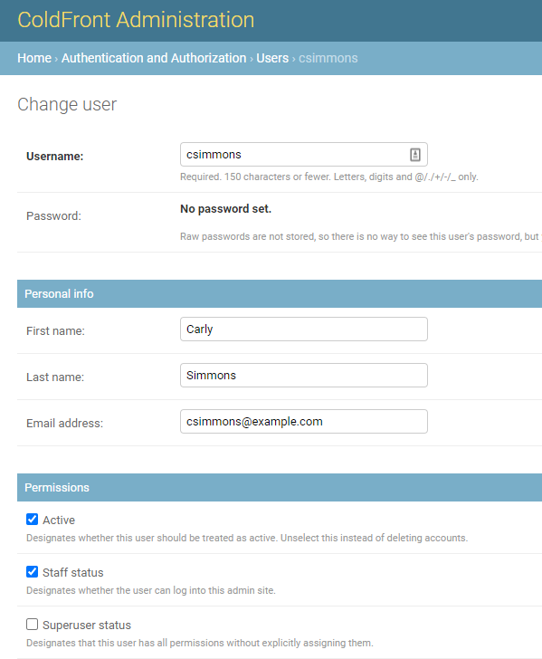
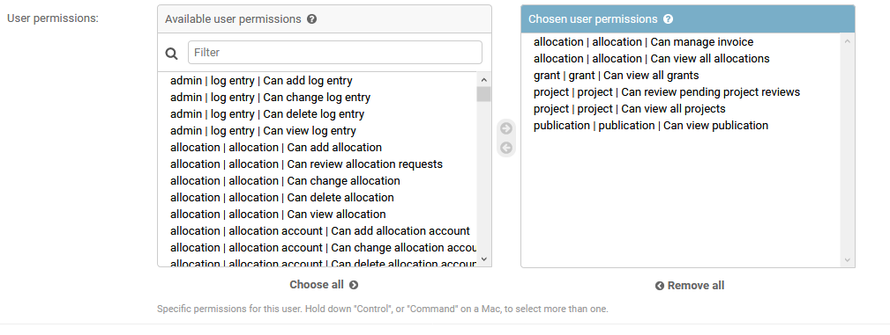
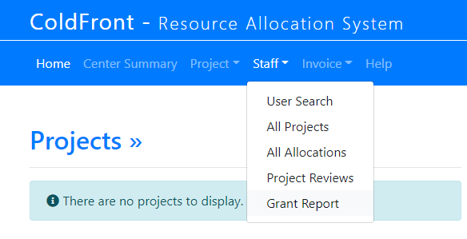

## Director Access

ColdFront provides Center Directors with ways to manage the process of reviewing and approving the renewal PI access - whether it's through allocations, the annual project review, or both.  Directors also have access to view all projects, allocations, and project data (publications, grants, research outputs), grant reports, and project reviews submitted by PIs.  To enable this extended access, you will want to enable "Staff Status" on the director's user account in the ColdFront Administration Dashboard:

  

In addition to this, you will need to add the following permissions:  
- allocation|allocation|Can view all allocations  
- grant|grant|Can view all grants  
- project|project|Can review pending project reviews  
- project|projects|Can view all projects  
- publication|publication|Can view publication
- allocation|allocation|Can manage invoice (optional)    
- allocation|allocation|Can view all allocation requests (optional)  

**Make sure to SAVE the change at the bottom right of this page.**

With these permissions granted, the director will see additional options on the Staff Menu: Project Reviews and Grant Report:

  

The director does not require access to manage invoices.  If you do not grant the permission for "allocation|allocation|Can manage invoice" the Invoice menu will not be displayed.
