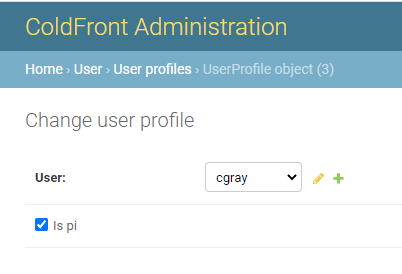
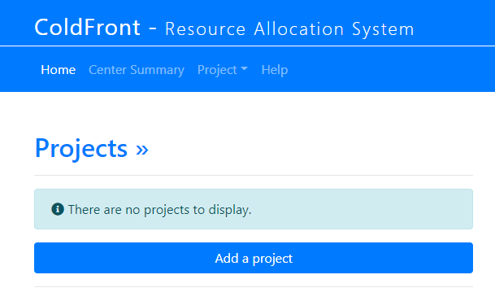

# PI or Project Owner

ColdFront affords PIs (or project owners) the ability to manage the access they and their group have to your center's resources.  PIs are permitted to add users to their group, request new allocations, renew expiring allocations, and provide information such as publications and grant data, as required by your center's policies.  PIs can maintain all their research information under one project or you can require them to separate the work into multiple projects, dependent on your center's processes.  

Before creating their first project, the user must have their account upgraded to 'PI' status.  There is no automation for this at the current time.  Most centers want to verify the user is a faculty member or staff member that would be able to manage these items for their group.  Once you've determined the user should have their access elevated, update this in the ColdFront Administration Dashboard under 'User Profiles' -  Click on the username and then check the box next to 'Is pi'

  
**Make sure to SAVE the change at the bottom right of this page.**

Once this is done, when the user logs in he/she will see the "Add Project" button on the ColdFront dashboard.

  

## What can a PI do that a manager can't?  

A PI holds the role of 'manager' on a project.  The PI may also change the role of any users on their project to 'manager'  [More details](manager.md)  

The only things a PI can do that a manager can not, is create a new project or archive a project.  All other project related tasks that a PI can do, a manager on that project can accomplish as well.  
