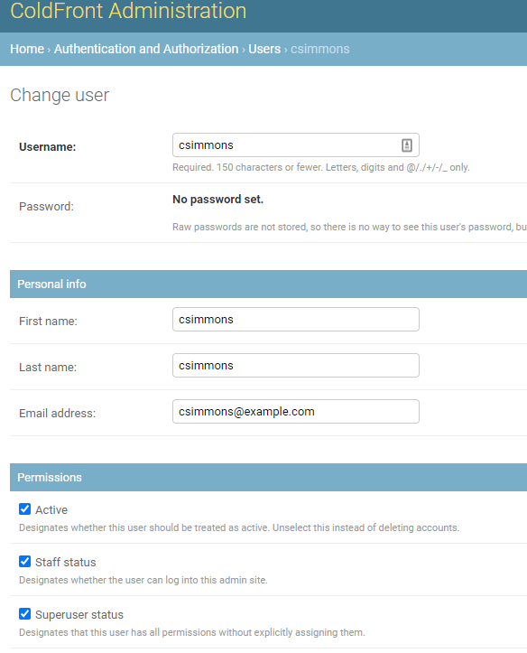
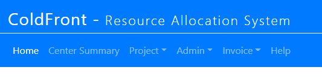

# System Administrators

System administration staff should be are afforded full access to ColdFront so they can see all data (projects, allocations, grants, publications, research outputs, users, invoices, reports, etc).  If you have a system administrator you do not want to have full access to ColdFront, we recommend you set their account to 'Staff Status' and add additional permissions on that individual account as necessary.  See [staff status information here](staff.md)

To enable a user as a system administrator in ColdFront, select their account in the ColdFront Administration Dashboard and click on the checkboxes next to BOTH 'Staff Status' and 'Superuser Status' and click save.

  
**Make sure to SAVE the change at the bottom right of this page.**

Once the user has been upgraded, they now see three additional menus: Admin, Staff, and Invoice and have access to the ColdFront Administration Dashboard.  

  
